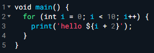
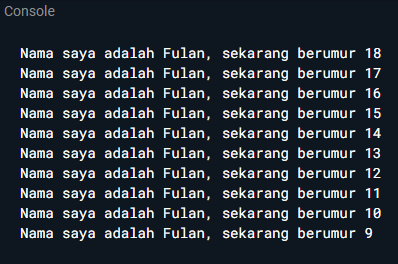
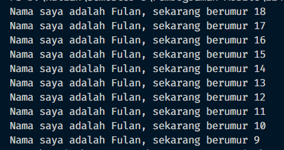
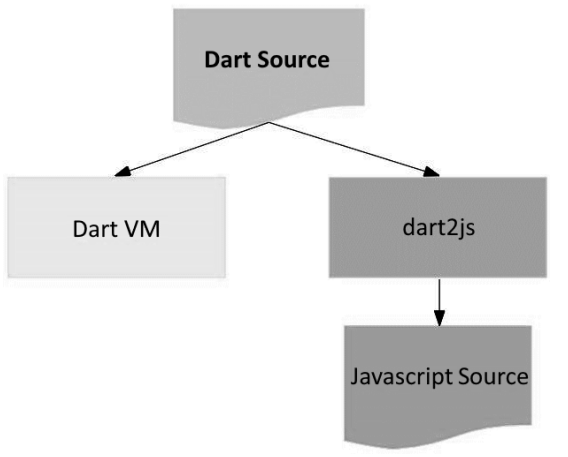

### Nama &nbsp;&nbsp;&nbsp;&nbsp;&nbsp;&nbsp;&nbsp; : Ihza Nurkhafidh Al-Baihaqi
### Kelas       &nbsp;&nbsp;&nbsp;&nbsp;&nbsp;&nbsp;&nbsp;&nbsp; : TI 3F
### No.Absen    &nbsp; : 11
<hr>
<br>

# Tugas Praktikum
1. Modifikasilah kode pada baris 3 di VS Code atau Editor Code favorit Anda berikut ini agar mendapatkan keluaran (output) sesuai yang diminta!


Output yang diminta:



Jawab:
```dart
    void main (){
    for (var i = 18; i >= 9; i--) {
        print('Nama saya adalah Fulan, sekarang berumur ${i}');
        }
    }
```



2. Mengapa sangat penting untuk memahami bahasa pemrograman Dart sebelum kita menggunakan framework Flutter ? Jelaskan!

    Jawab:

        Memahami bahasa pemrograman Dart sebelum menggunakan Flutter sangat penting karena Flutter dibangun di atas Dart, dan semua logika aplikasi Flutter ditulis dalam bahasa tersebut. Dengan menguasai Dart, kamu akan lebih mudah memahami cara kerja Flutter, seperti bagaimana struktur kode, pengelolaan data, dan interaksi antar bagian aplikasi. Dart juga memiliki fitur yang memudahkan pembuatan aplikasi UI yang responsif dan performa tinggi, seperti hot reload dan penggunaan widget. Jadi, dengan pemahaman yang baik tentang Dart, kamu bisa membangun aplikasi Flutter dengan lebih efisien dan tanpa kebingungan tentang dasar-dasar pemrogramannya.


3. Rangkumlah materi dari codelab ini menjadi poin-poin penting yang dapat Anda gunakan untuk membantu proses pengembangan aplikasi mobile menggunakan framework Flutter.

    Jawab:

    Dart diciptakan pada tahun 2011 dan telah berkembang sejak saat itu (2013 versi stabil). Dart awalnya berfokusd pada pem=ngembangan web dengan tujuan untuk menjadi penerus JS. Dart diciptakan karena ingin mengembangkan kelebihan-kelebihan dari sebagian besar bahasa tingkat tinggi, seperti
        
    - Productive Tooling
    - Garbage collection
    - Type annotations
    - Statically typed
    - Portability

    Dart memiliki 2 cara kerja 
    - Dart Virtual Machine (VMs)
    - JS compilations

    perhatikan gambar berikut
    
    Seperti yang Anda lihat, pada bagian atas diagram adalah kode Dart Anda. Perlu dicatat bahwa kode dan dependensi Anda bisa jadi tidak sesuai dengan cara Anda mengeksekusikan aplikasi; namun tidak perlu melakukan banyak perubahan pada kode Anda untuk dapat mendukung cross-platform.

    Eksekusi kode dart dapat beroprasi dalam dua mode
    - JIT (just in time): tempat kode sumber dikompilasi sesuai kebutuhan—Just in time. Dart VM memuat dan mengkompilasi kode sumber ke kode mesin asli (native)
    - Kompilasi Ahead of Time (AOT): dimana Dart VM dan kode Anda dikompilasi sebelumnya, VM bekerja lebih seperti sistem runtime Dart, yang menyediakan garbage collector dan metode-metode native dari Dart software development kit (SDK) pada aplikasi.

    Dart merupakan bahasa pemrograman yang memiliki pendekatan OOP, Dart juga dapat menggunakan operator aritmatik, increment/decrement, equality, logical operator dll. sama seperti bahasa pemrograman lainnya
