### Nama &nbsp;&nbsp;&nbsp;&nbsp;&nbsp;&nbsp;&nbsp; : Ihza Nurkhafidh Al-Baihaqi
### Kelas       &nbsp;&nbsp;&nbsp;&nbsp;&nbsp;&nbsp;&nbsp;&nbsp; : TI 3F
### No.Absen    &nbsp; : 11

 

# Praktikum 1: Menerapkan control flows
1. langkah 1

    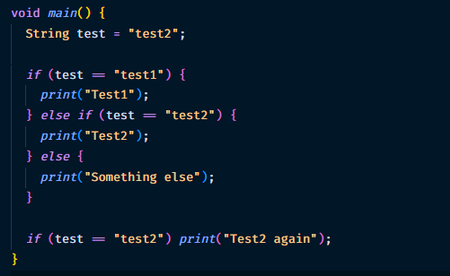
2. Silakan coba eksekusi (Run) kode pada langkah 1 tersebut. Apa yang terjadi? Jelaskan!

    Jawab: karena pada variable test berisi test2 maka kondisi yang akan dieksekusi pada baris else if dikarenakan kondisinya memenuhi, lalu pada condition selanjutkan kita membuat lagi dengan bentuk 1 line dikarenakan hanya memuat 1 kondisi saja

3. Langkah 3

    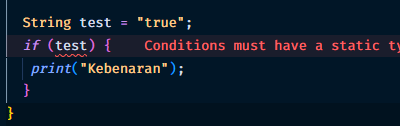
    
    jawab: error dikarenakan if statement hanya bisa menampung sebuah value boolean, namun pada kode tersebut dikirimkan sebuah true namun berbentuk string bukan boolean, berikut adalah kode setelah diperbaiki

    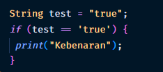  
    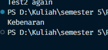

# Praktikum 2
1. Langkah 1

    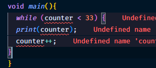

2. Silakan coba eksekusi (Run) kode pada langkah 1 tersebut. Apa yang terjadi? Jelaskan! Lalu perbaiki jika terjadi error.

    Jawab: error dikarenakan tidak adanya variable counter, berikut kode setelah diperbaiki

    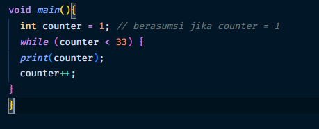

3. Langkah 3

    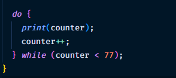

# Praktikum 3
1. Langkah 1

    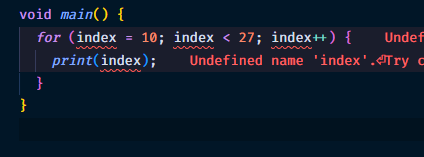

2. Silakan coba eksekusi (Run) kode pada langkah 1 tersebut. Apa yang terjadi? Jelaskan! Lalu perbaiki jika terjadi error.

    Jawab: terjadi error dikarenakan penulisan pada for i kurang tepat, berikut kode yang telah diperbaiki

    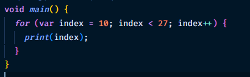

3. Langkah 3

    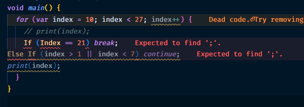

    Jawab: kode error, dikarenakan penulisan dari if else yang kurang tepat, berikut merupakan kode yang telah diperbaiki

    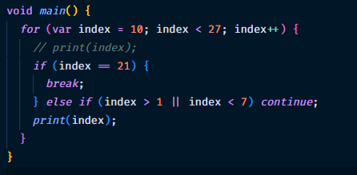

# Tugas Praktikum 
1. Buatlah sebuah program yang dapat menampilkan bilangan prima dari angka 0 sampai 201 menggunakan Dart. Ketika bilangan prima ditemukan, maka tampilkan nama lengkap dan NIM Anda.

    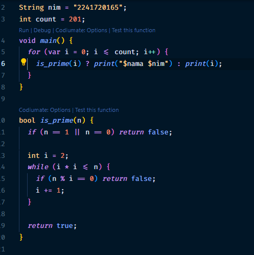
    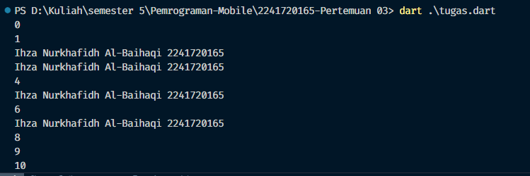