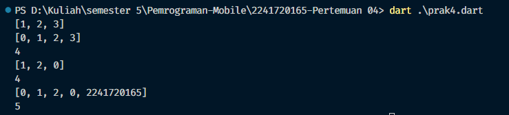
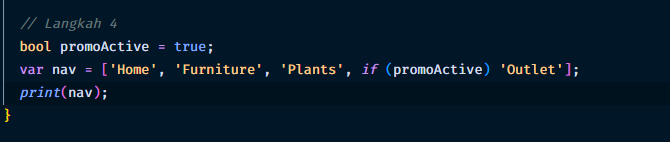

### Nama &nbsp;&nbsp;&nbsp;&nbsp;&nbsp;&nbsp;&nbsp; : Ihza Nurkhafidh Al-Baihaqi
### Kelas       &nbsp;&nbsp;&nbsp;&nbsp;&nbsp;&nbsp;&nbsp;&nbsp; : TI 3F
### No.Absen    &nbsp; : 11
<hr>
<br>

# Praktikum 1: Eksperimen tipe data list

1. Langkah 1
    
    

2. Silakan coba eksekusi (Run) kode pada langkah 1 tersebut. Apa yang terjadi? Jelaskan!

    Jawab: 
    
    Diatas merupakan output dari program yang diberikan, namun disini ada yang menarik, yaitu function assert pada kode, function ini digunakan untuk mengecek pada kondisi tertentu didalam program, jika value yang diberikan pada assert bernilai false maka program akan langsung berhenti dan menampilkan sebuah pesan kesalahan, namun function assert ini hanya akan bekerja ketika kita sedang menjalankan mode debungging.

3. Ubah kode pada langkah 1 menjadi variabel final yang mempunyai index = 5 dengan default value = null. Isilah nama dan NIM Anda pada elemen index ke-1 dan ke-2. Lalu print dan capture hasilnya

    

# Praktikum 2

1. Langkah 1

    

2. Silakan coba eksekusi (Run) kode pada langkah 1 tersebut. Apa yang terjadi? Jelaskan! Lalu perbaiki jika terjadi error.

3. Langkah 3

    

    Tambahkan elemen nama dan NIM Anda pada kedua variabel Set tersebut dengan dua fungsi berbeda yaitu .add() dan .addAll(). Untuk variabel Map dihapus, nanti kita coba di praktikum selanjutnya.

    <br>
    

# Praktikum 4

1. Langkah 1

    

2. Silakan coba eksekusi (Run) kode pada langkah 1 tersebut. Apa yang terjadi? Jelaskan! Lalu perbaiki jika terjadi error.

3. Langkah 3

    

    Tambahkan elemen nama dan NIM Anda pada tiap variabel di atas (gifts, nobleGases, mhs1, dan mhs2). Dokumentasikan hasilnya dan buat laporannya!

     <br>
    

# Praktikum 4

1. Langkah 1

    

2. Kode yang telah diperbaiki

    <br>
    

3. Langkah 3

    
    Tambahkan variabel list berisi NIM Anda menggunakan Spread Operators. Dokumentasikan hasilnya dan buat laporannya!

    <br>
    

4. Langkah 4

    Jika Aktif

    <br>
    

    Jika Tidak Aktif

    <br>
    

    Item akan ditambahkan ke dalam list jika kondisi true

5. Langkah 5

    Jika login == manager

    <br>
    

    Jika login != manager

    <br>
    

6. Langkah 6

     <br>
    

    for pada list tersebut digunakan ketika kita ingin memasukkan sebuah data dari list lain ke list yang kita inginkan namun kita ingin mengolahnya terlebih dahulu.

# Praktikum 5

1. Langkah 1

    <br>
    

2. Silakan coba eksekusi (Run) kode pada langkah 1 tersebut. Apa yang terjadi? Jelaskan! Lalu perbaiki jika terjadi error.

3. Langkah 3

    

    Disini kita membuat function dengan return sebuah records

4. Langkah 4

    

    error dikarenakan value yang akan diprint bernilai null, berikut kode yang telah diperbaiki

    <br>
    

5. Langkah 5

    <br>
    

    Disini kita belajar cara mengakses data dari sebuah record dengan menggunakan key, namun jika data tidak teroksplisitkan key nya maka kita bisa menggunakan tanda dollar $ untuk mengakses nya, ini merupakan fitur yang diberikan dart

# Tugas Praktikum


1. Pengertian Functions dalam Bahasa Dart
Dalam bahasa Dart, function adalah blok kode yang dapat digunakan kembali yang melakukan tugas tertentu. Function mempermudah pengorganisasian kode dan membuatnya lebih modular. Dalam Dart, function bisa didefinisikan dengan nama atau tanpa nama (anonymous).

```dart
    void main() {
        printGreeting();  // Memanggil function
    }

    void printGreeting() {
      print('Hello, World!');  // Isi function
    }
```

2. Jenis-Jenis Parameter di Functions
Dart mendukung beberapa jenis parameter dalam function:

Positional Parameters: Parameter yang diharapkan berada pada urutan tertentu.
```dart
    void printInfo(String name, int age) {
      print("Name: $name, Age: $age");
    }

    void main() {
      printInfo("Alice", 25);  // Output: Name: Alice, Age: 25
    }

```

Optional Positional Parameters: Parameter yang bisa diabaikan saat function dipanggil dan ditandai dengan tanda kurung siku [].
```dart
    void printInfo(String name, [int? age]) {
      print("Name: $name, Age: ${age ?? 'Not provided'}");
    }

    void main() {
      printInfo("Alice");  // Output: Name: Alice, Age: Not provided
    }
```

Named Parameters: Parameter yang dipanggil dengan nama, bukan posisinya. Parameter ini dibungkus dalam {}.
```dart
    void printInfo({required String name, int? age}) {
      print("Name: $name, Age: ${age ?? 'Not provided'}");
    }

    void main() {
      printInfo(name: "Alice", age: 25);  // Output: Name: Alice, Age: 25
    } 
```

Default Parameters: Parameter yang memiliki nilai default jika tidak diberikan nilai.
```dart
    void printInfo({String name = "Unknown", int age = 0}) {
      print("Name: $name, Age: $age");
    }

    void main() {
      printInfo();  // Output: Name: Unknown, Age: 0
    }
```

3. Functions sebagai First-Class Objects
Dalam Dart, functions dianggap sebagai first-class objects, artinya function dapat disimpan dalam variabel, dikirimkan sebagai argumen ke function lain, atau dikembalikan dari function lain.

```dart
    void main() {
      var sayHello = () => print('Hello!');  // Menyimpan function dalam variabel
      sayHello();  // Memanggil function dari variabel

      Function performTask = sayHello;  // Menyimpan function dalam variabel Function
      performTask();  // Output: Hello!
    }
```

4. Anonymous Functions
Anonymous functions (function tanpa nama) adalah function yang didefinisikan tanpa nama. Mereka sering digunakan ketika function hanya digunakan sekali atau sebagai argumen untuk function lain (misalnya dalam operasi list atau callback).

```dart
    void main() {
      var list = ['Alice', 'Bob', 'Charlie'];

      list.forEach((name) {
        print(name);  // Anonymous function sebagai argumen
      });
    }
```

5. Lexical Scope dan Lexical Closures
Lexical Scope: Lingkup di mana variabel dideklarasikan, menentukan di mana variabel tersebut dapat diakses. Dalam Dart, variabel hanya bisa diakses dalam blok tempat variabel tersebut dideklarasikan.
```dart
    void main() {
      var name = 'Alice';  // Scope 'name' terbatas di main()

      void sayHello() {
        print('Hello, $name');  // Bisa akses 'name'
      }

      sayHello();  // Output: Hello, Alice
    }
```

Lexical Closure: Function yang dapat mengakses variabel di luar cakupannya (scope), bahkan setelah function itu selesai dijalankan. Closure mengikat variabel lokal agar tetap tersedia setelah function selesai.
```dart
    Function makeMultiplier(num factor) {
      return (num i) => i * factor;  // 'factor' disimpan dalam closure
    }

    void main() {
      var multiplierBy2 = makeMultiplier(2);  // Closure di sini
      print(multiplierBy2(3));  // Output: 6
    }
```

6. Cara Membuat Return Multiple Values di Functions
Dart tidak mendukung multiple return values secara langsung, tetapi kita bisa menggunakan beberapa pendekatan, seperti menggunakan List, Map, atau Record (Dart 3 ke atas) untuk mengembalikan beberapa nilai.

```dart
    (String, int) getUserInfo() {
      return ('Alice', 25);  // Mengembalikan dua nilai
    }

    void main() {
      var (name, age) = getUserInfo();  // Destrukturisasi nilai
      print('Name: $name, Age: $age');  // Output: Name: Alice, Age: 25
    }
```
```dart
    List<dynamic> getUserInfo() {
      return ['Alice', 25];  // Mengembalikan List
    }

    void main() {
      var userInfo = getUserInfo();
      print('Name: ${userInfo[0]}, Age: ${userInfo[1]}');  // Output: Name: Alice, Age: 25
    }
```