### Nama &nbsp;&nbsp;&nbsp;&nbsp;&nbsp;&nbsp;&nbsp; : Ihza Nurkhafidh Al-Baihaqi

### Kelas &nbsp;&nbsp;&nbsp;&nbsp;&nbsp;&nbsp;&nbsp;&nbsp; : TI 3F

### No.Absen &nbsp; : 11

 

# Menerapkan Widget Dasar

 

### Langkah 1: Text Widget

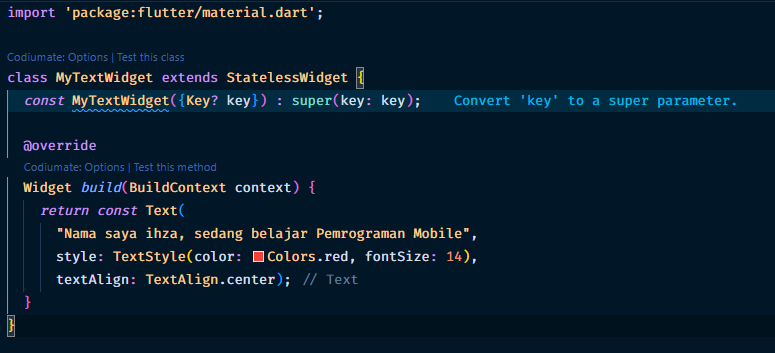

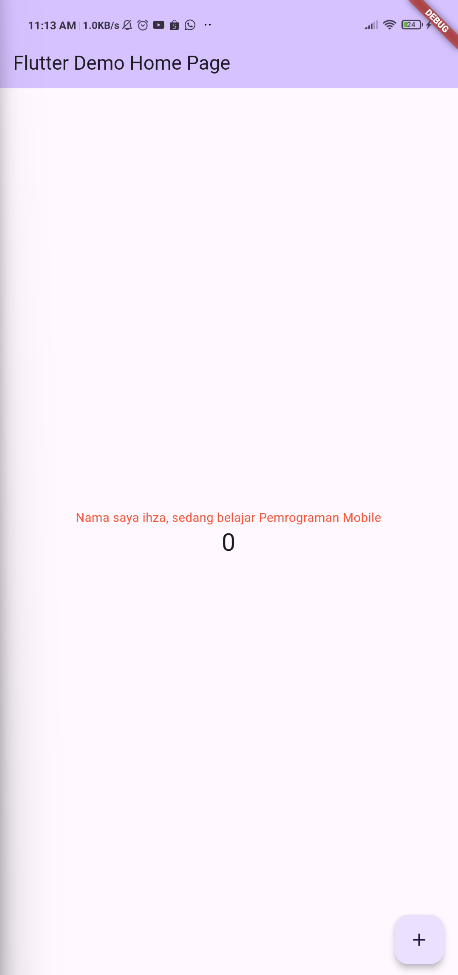

### Langkah 2: Image Widget

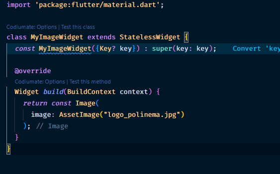
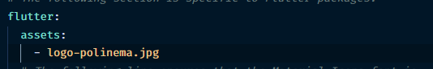
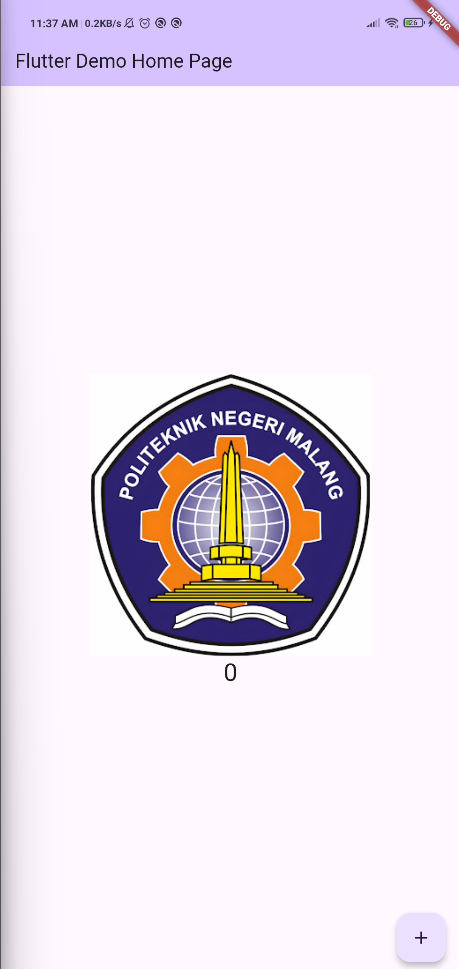

# Menerapkan Widget Material Design dan iOS Cupertino

### Cupertino Button dan Loading Bar

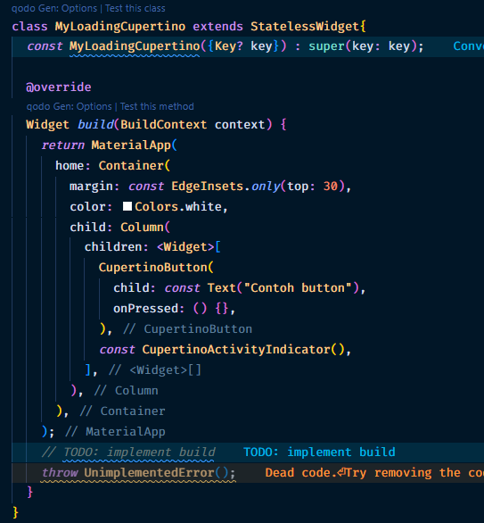
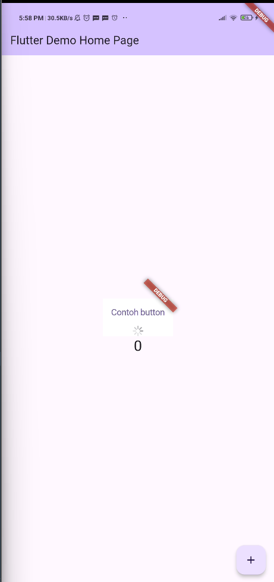

### Floating Action Button (FAB)

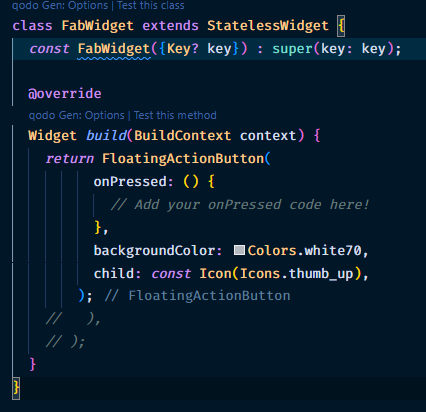
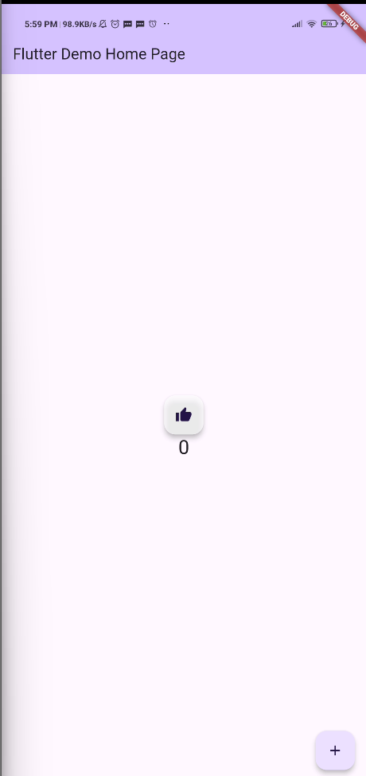

### Scaffold Widget

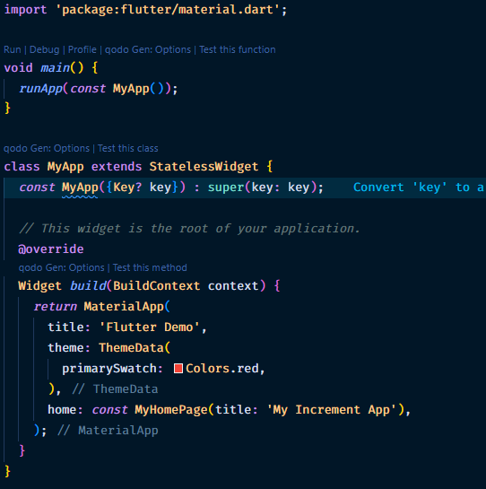
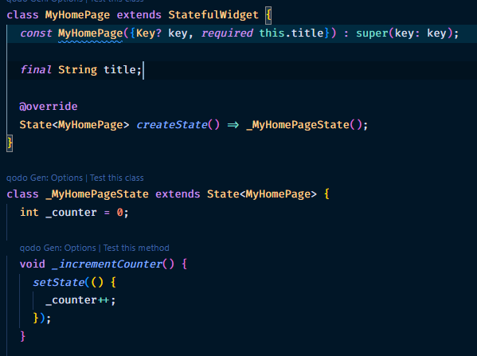
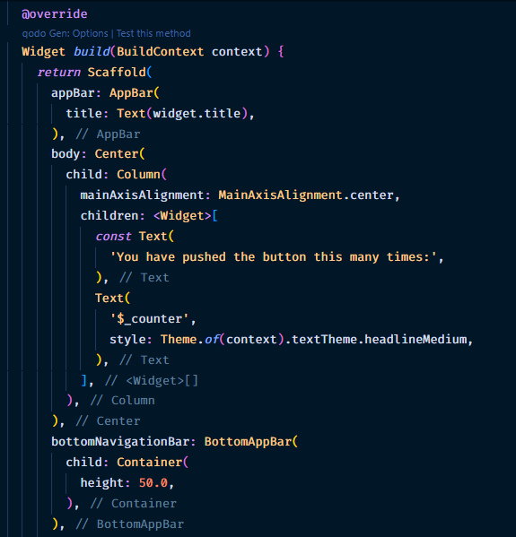
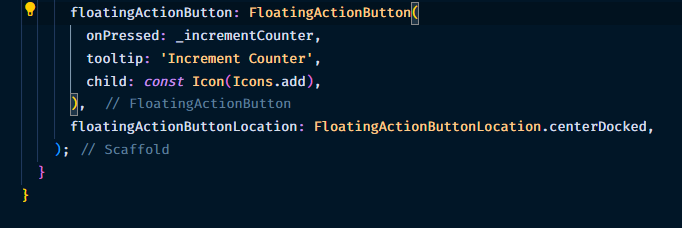
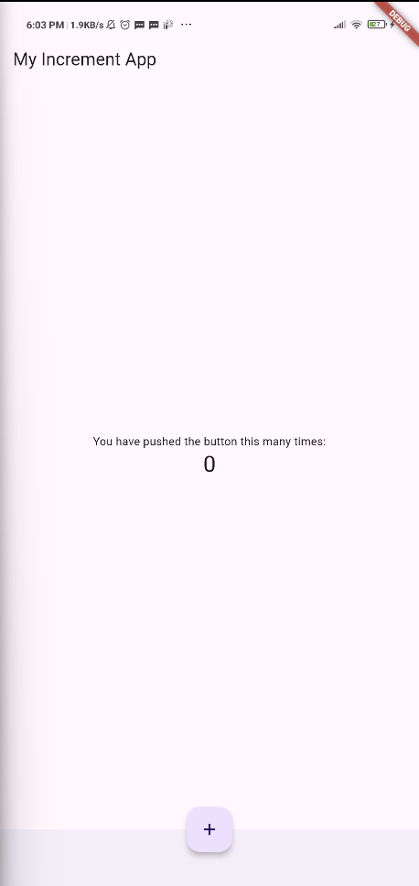

### Dialog Widget

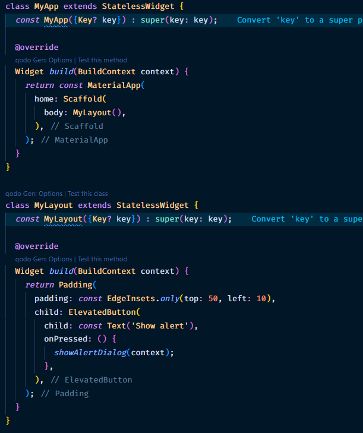
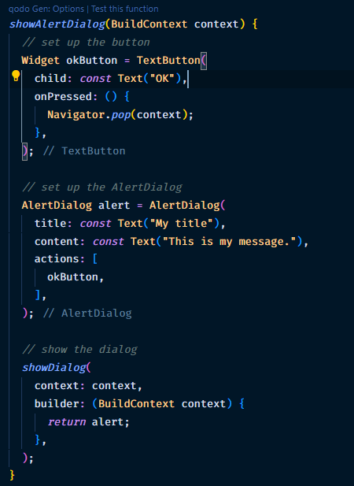
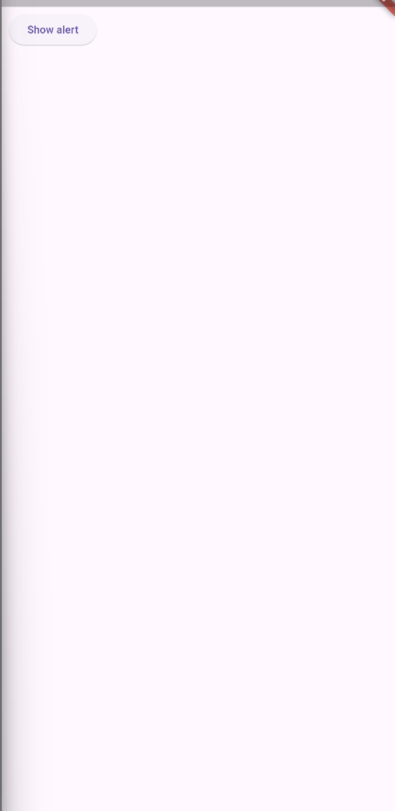

### Input dan Selection Widget

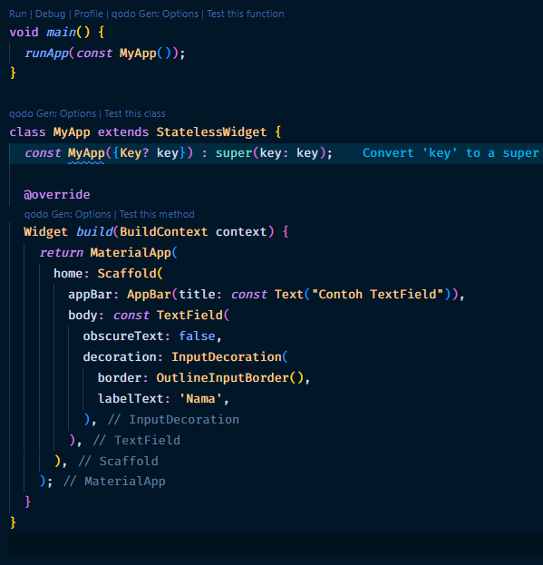
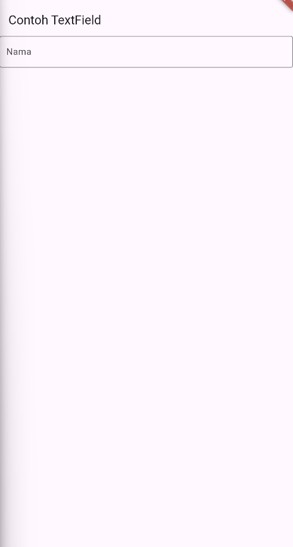

### Date and Time Pickers

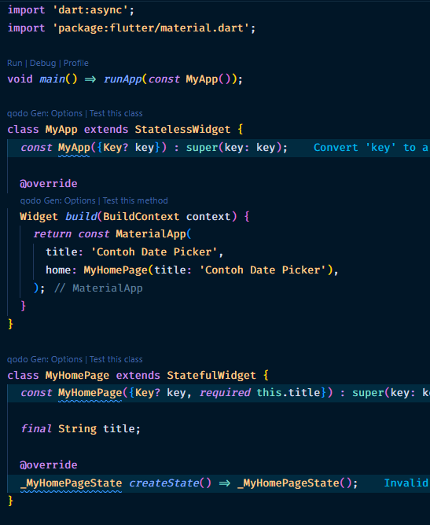
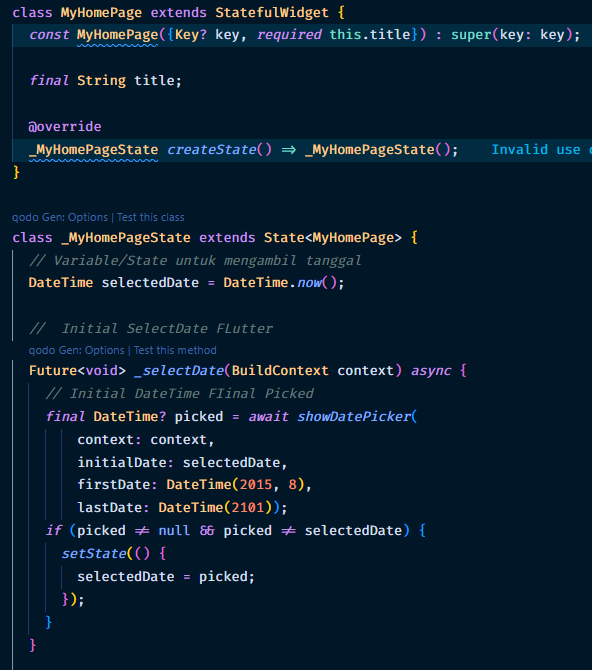
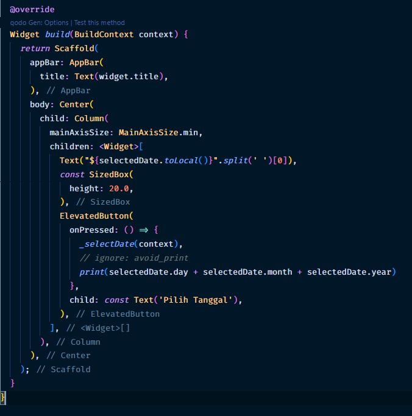
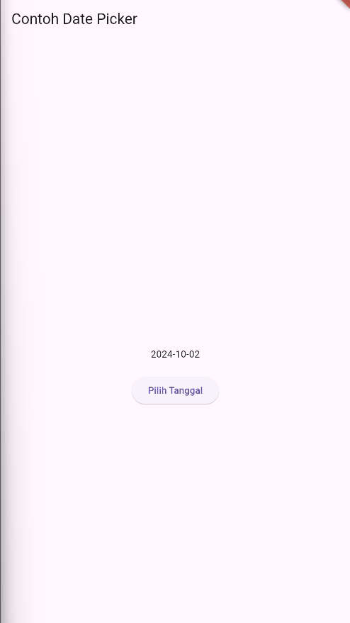
