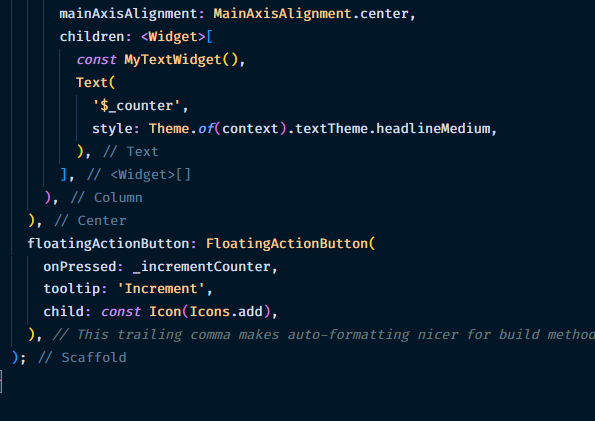

### Nama &nbsp;&nbsp;&nbsp;&nbsp;&nbsp;&nbsp;&nbsp; : Ihza Nurkhafidh Al-Baihaqi

### Kelas &nbsp;&nbsp;&nbsp;&nbsp;&nbsp;&nbsp;&nbsp;&nbsp; : TI 3F

### No.Absen &nbsp; : 11

 

# Menerapkan Widget Dasar

 

### Langkah 1: Text Widget

### Langkah 2: Image Widget

# Menerapkan Widget Material Design dan iOS Cupertino

### Cupertino Button dan Loading Bar

### Floating Action Button (FAB)

### Scaffold Widget

### Dialog Widget

### Input dan Selection Widget

### Date and Time Pickers

