# TUGAS

## My Awesome Namer Project

### Create Project

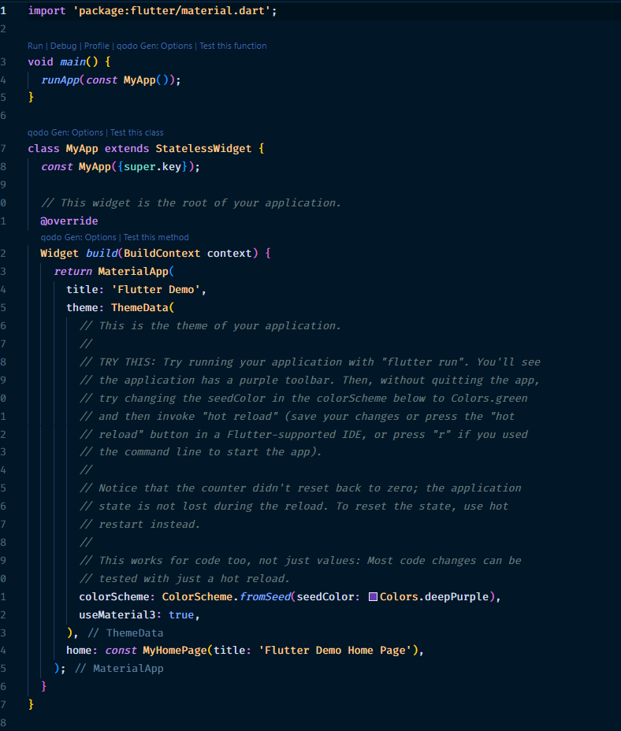

### konfigurasi pubspec.yaml

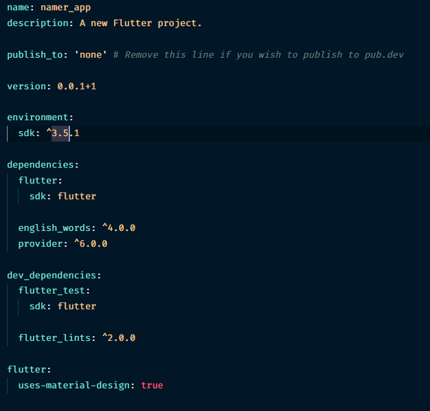

### konfigurasi analysis_options.yaml

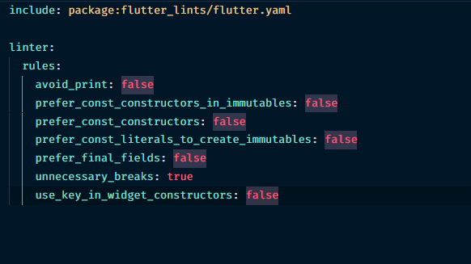

### konfigurais main.dart

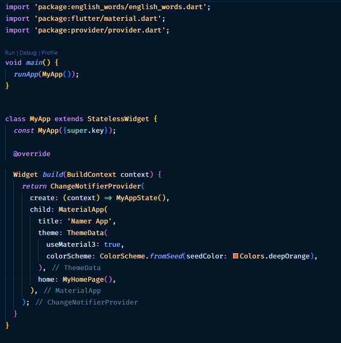
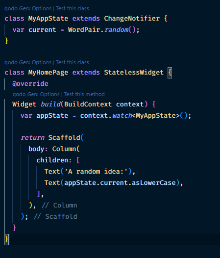
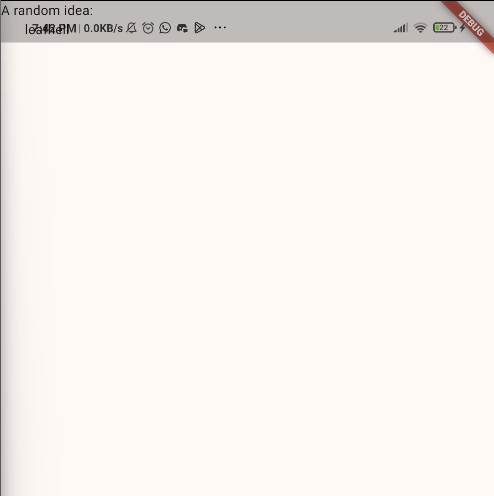

### Add button

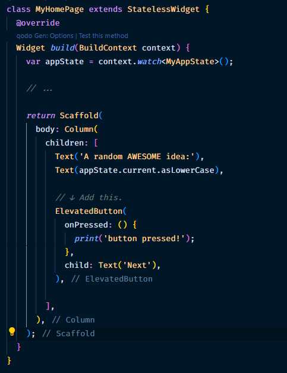
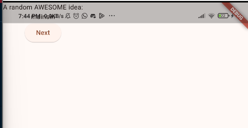
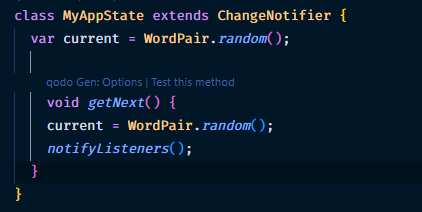

### Make App Prettier

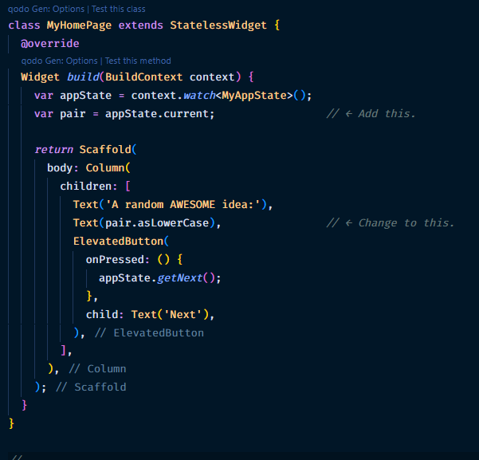
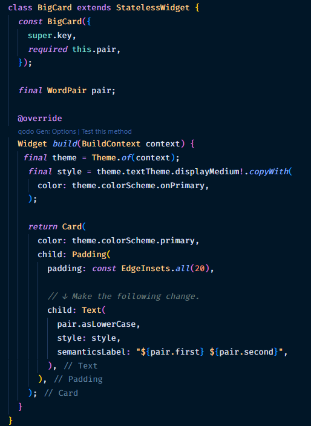
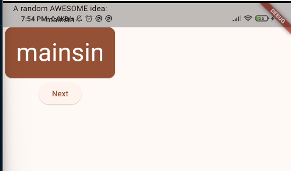

### Add Functionality

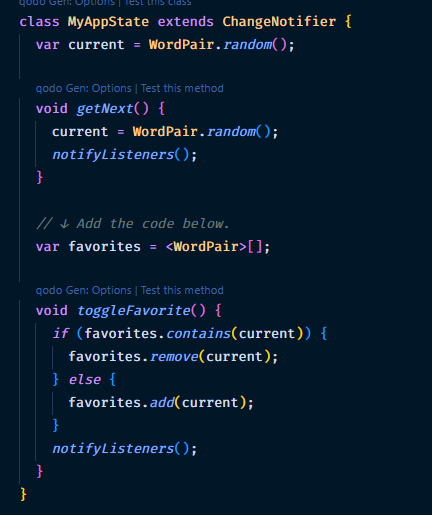
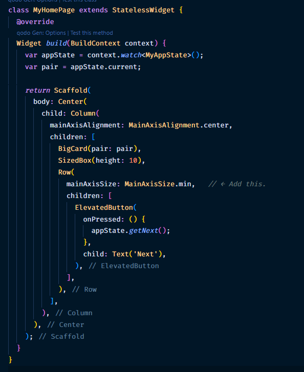
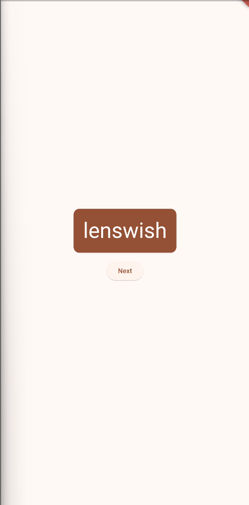
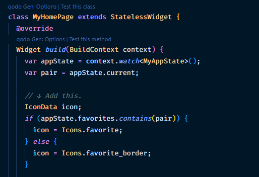
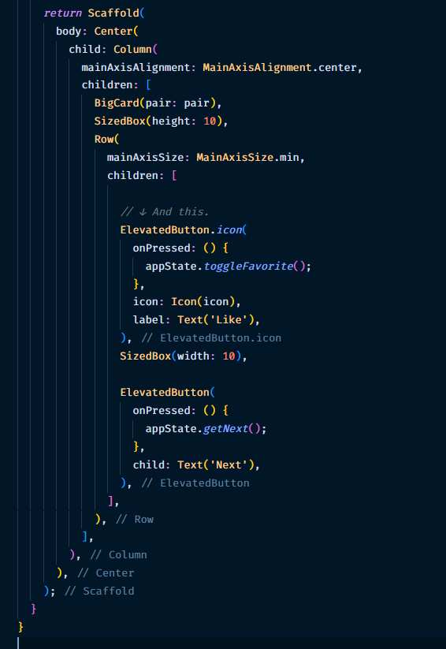
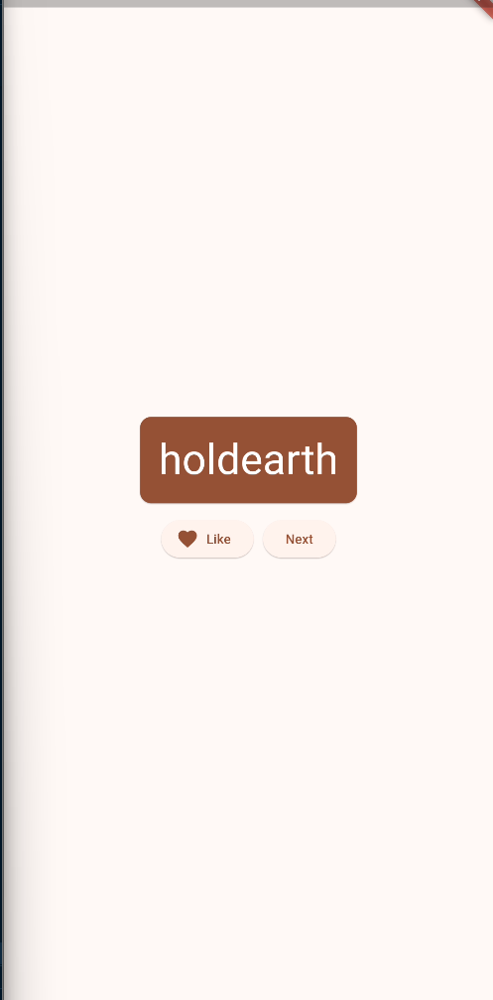

### Add navigation rail

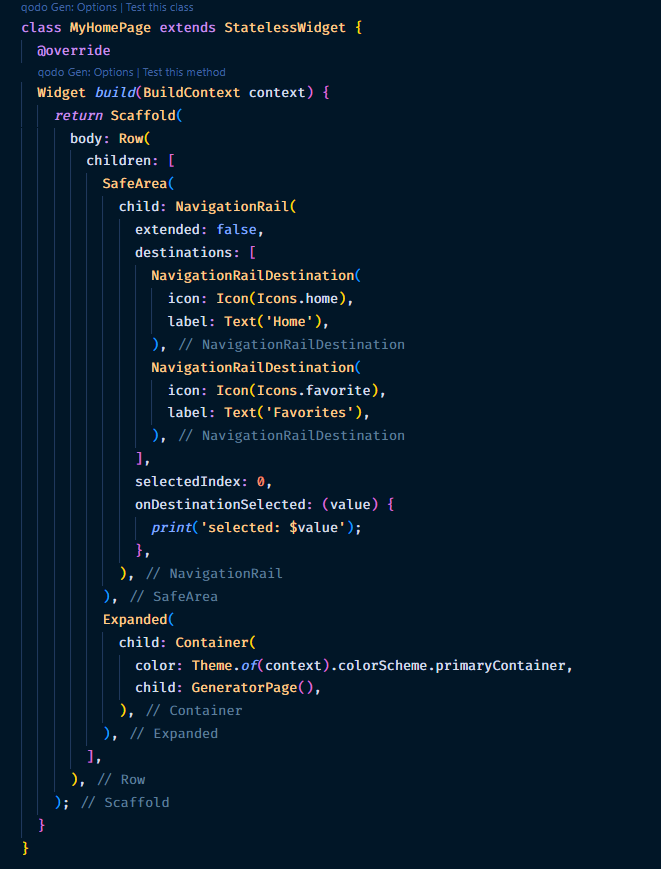
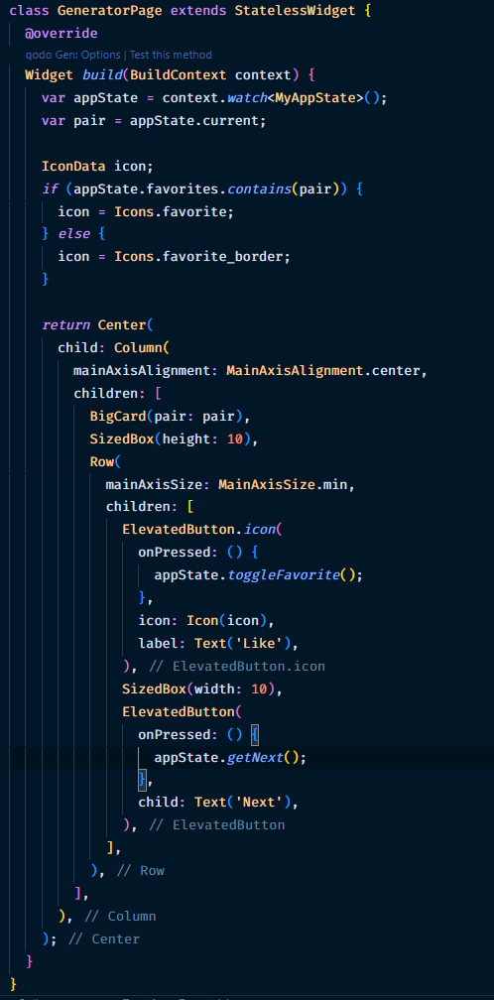

### Add a new page

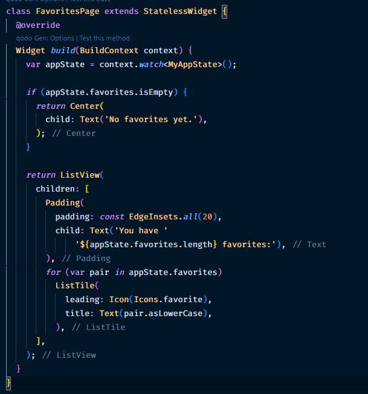
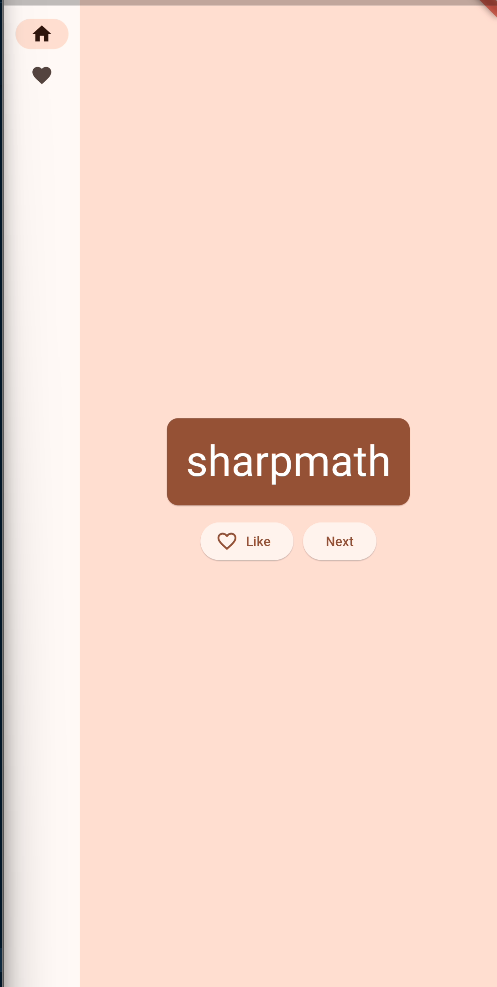
