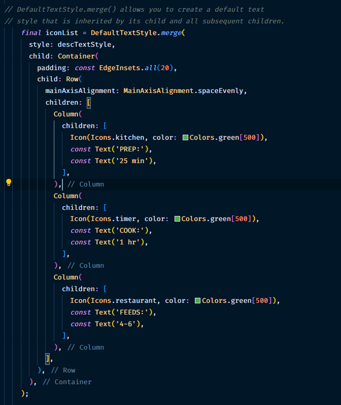

# TUGAS 1 PERTEMUAN 6

1. inisialisasi title

2. Subtitle

3. inisialisasi variable star untuk rating

4. menggunakan variable star

5. styling deskripsi

6. list icon

7. menata aligment pada kolom kiri

8. main image

9. implementasi

10. hasil
