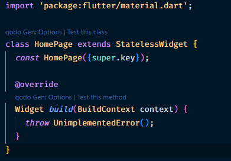
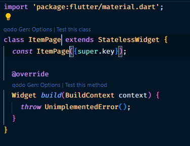
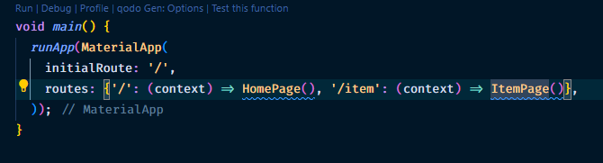
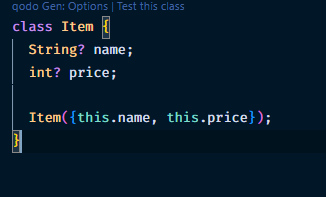
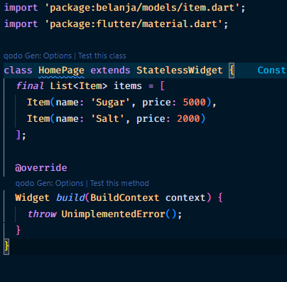
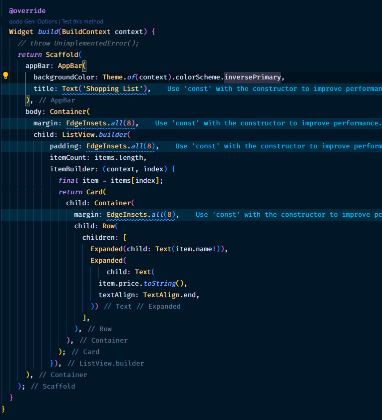
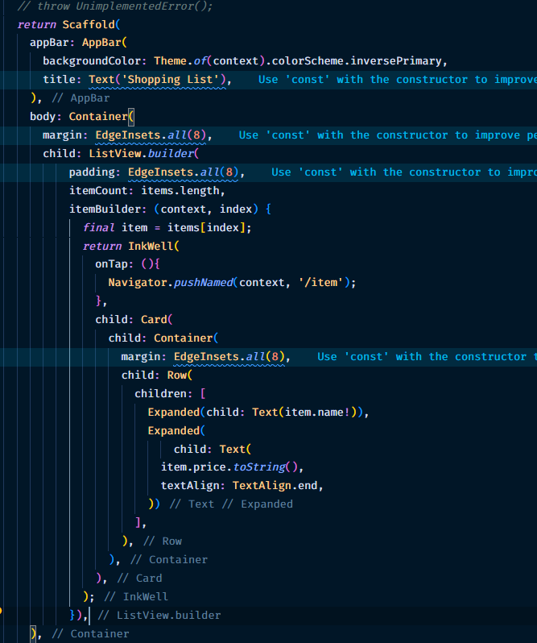
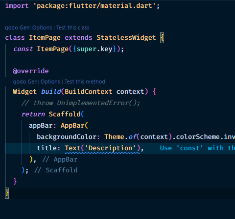
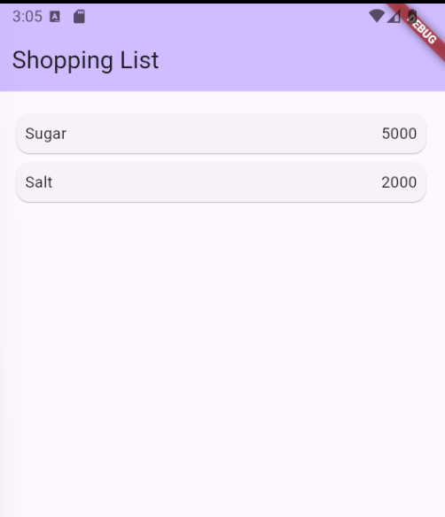

### Nama: Ihza Nurkhafidh Al-Baihaqi
### Kelas: TI 3F
### NIM: 2241720165 
 

# Praktikum 5: Membangun Navigasi di Flutter
### Menyiapkan atau membuat struktur folder

### Mendfinisikan Route

### Melengkapi Kode dalam main.dart

### Membuat Data Model

### Melengkapi kode di class HomePage

### Membuat ListView dan ItemBuilder

### Menambahkan aksi pada ListView

