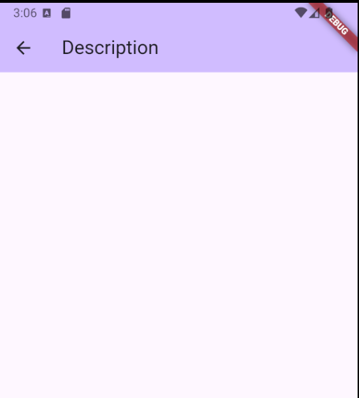
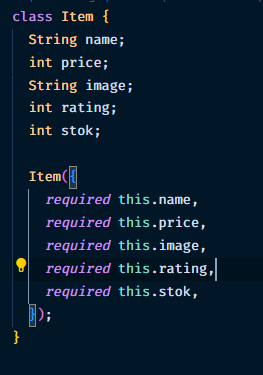
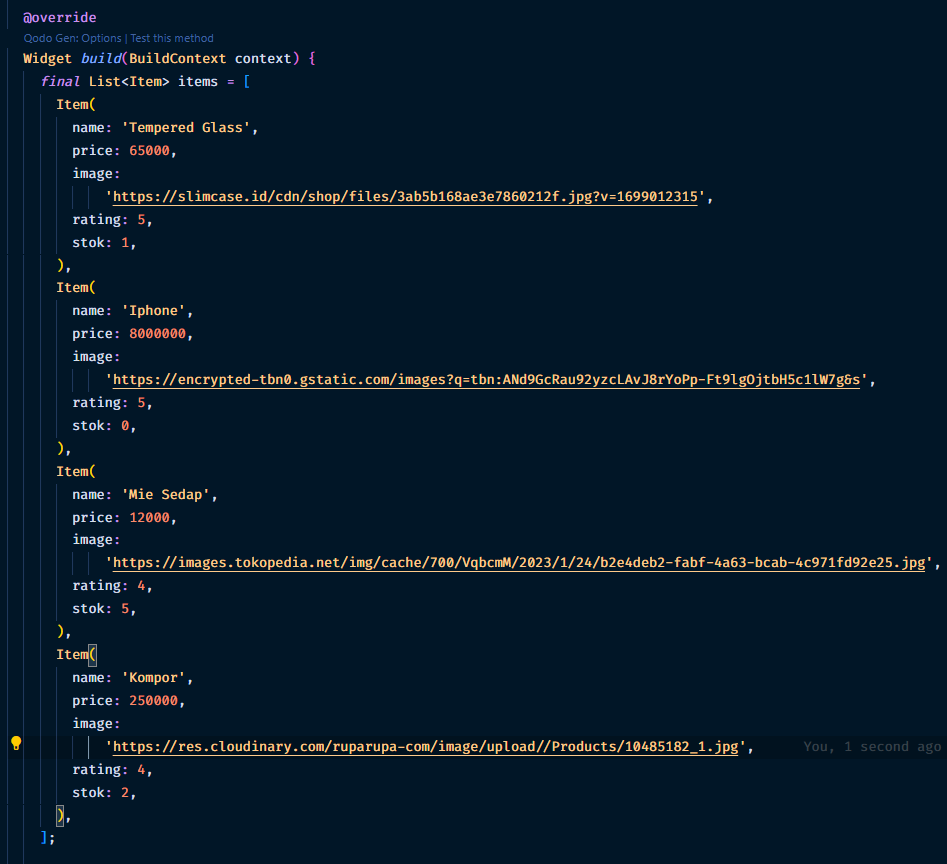
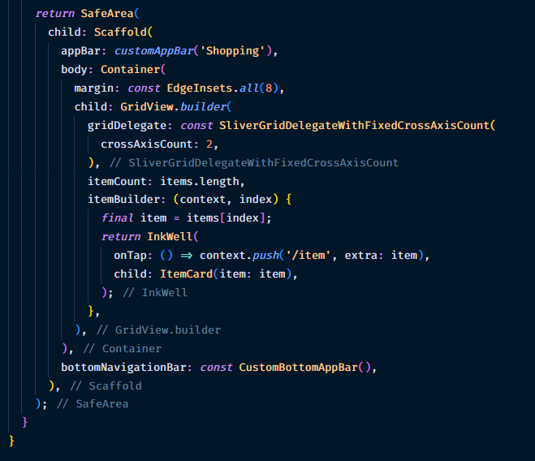
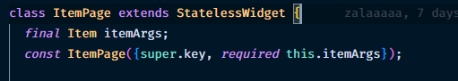
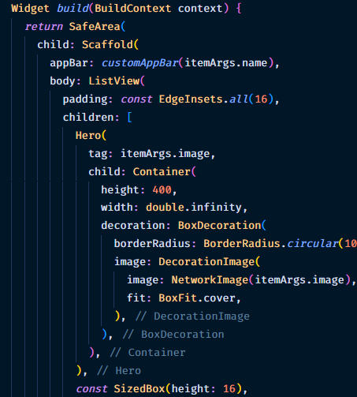
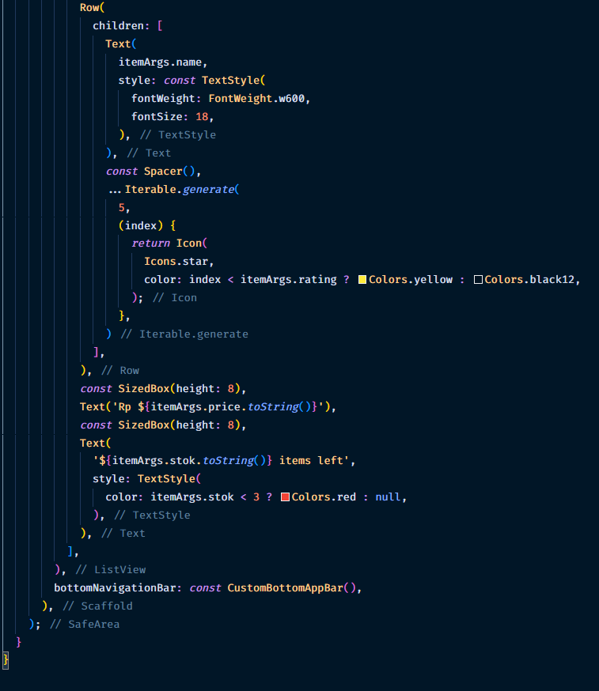
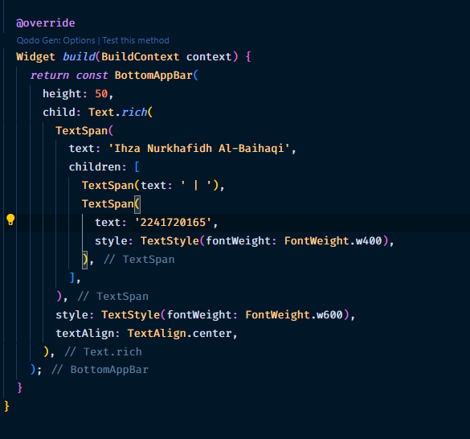
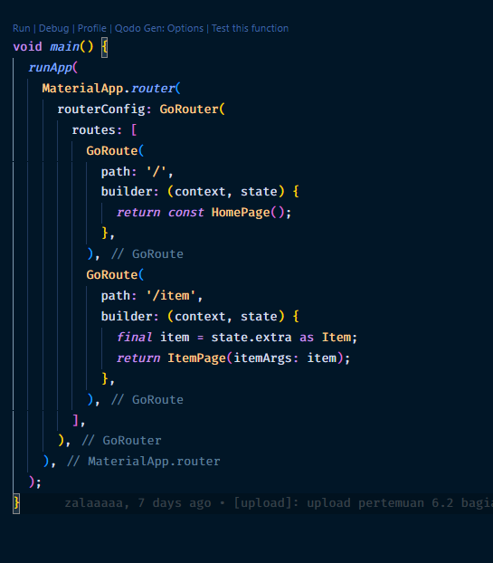

### Nama: Ihza Nurkhafidh Al-Baihaqi

### Kelas: TI 3F

### NIM: 2241720165

 

# Praktikum 5: Membangun Navigasi di Flutter

### Menyiapkan atau membuat struktur folder

### Mendfinisikan Route

### Melengkapi Kode dalam main.dart

### Membuat Data Model

### Melengkapi kode di class HomePage

### Membuat ListView dan ItemBuilder

### Menambahkan aksi pada ListView

# Tugas 2

1. penambahan atribut pada item
   

2. konfigurasi homepage
   
   

3. konfigurasi page untuk menjelaskan item
   
   
   

4. membuat bottom bar
   

5. konfigurasi main
   
