### Nama : IHza Nurkhafidh Al-Baihaqi

### Kelas : TI 3F

### NIM : 2241720165

 

# Praktikum 1: Membangun Layout di FLutter

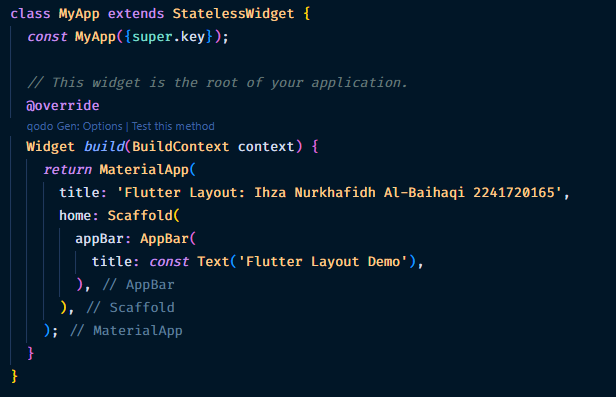
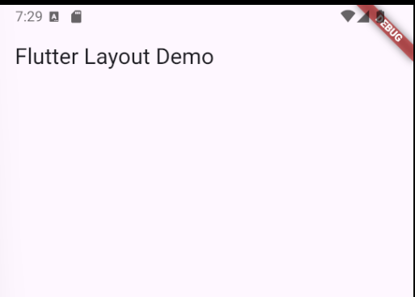
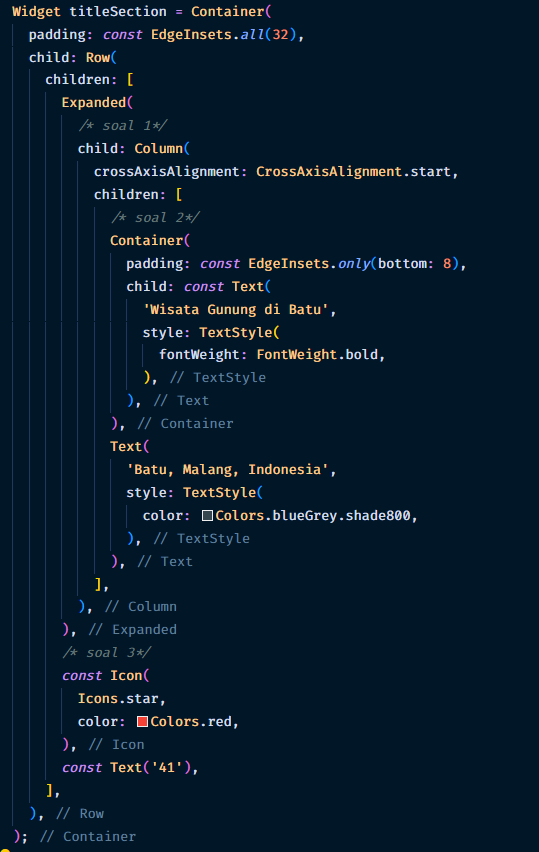
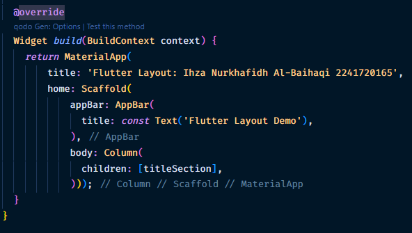

# Praktikum 2: Implementasi Button Row

### Buat method Column \_buildButtonColumn

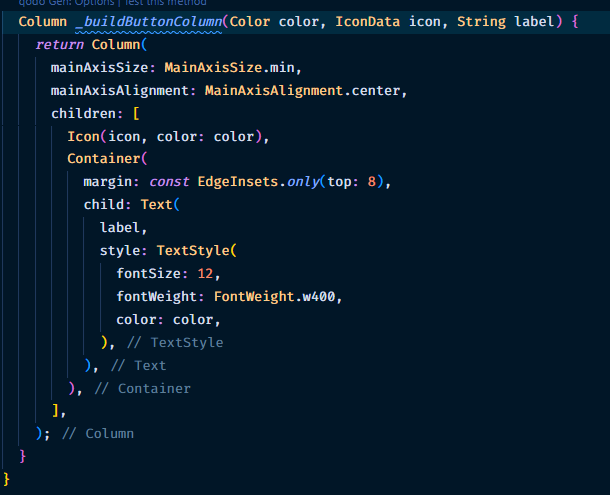

### Buat widget buttonSection

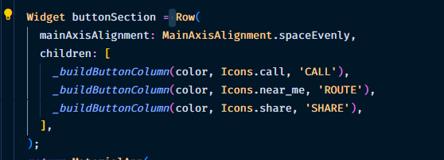
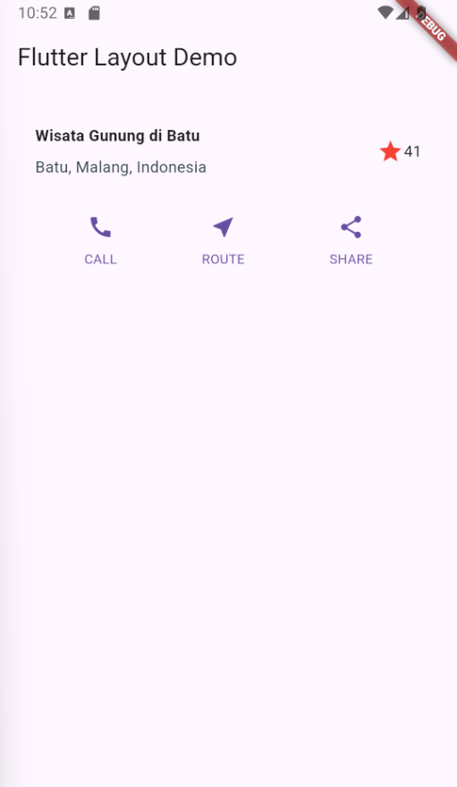

# Praktikum 3: Implementasi text section

### Buat widget textSection

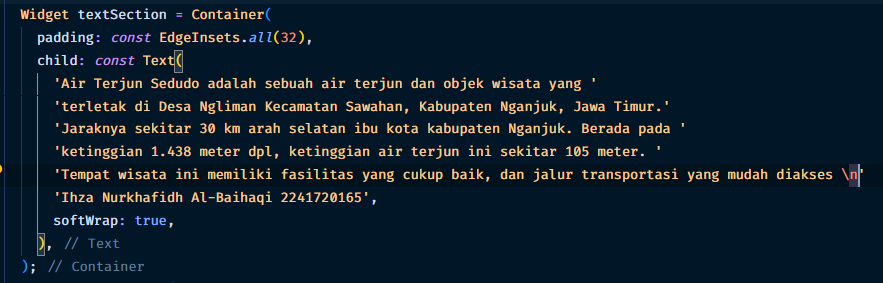

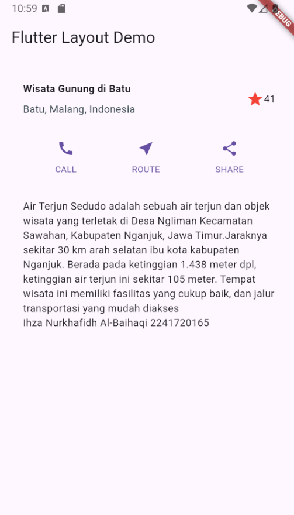

# Praktikum 4: Implementai laporan/assets/Image Section

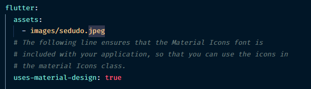
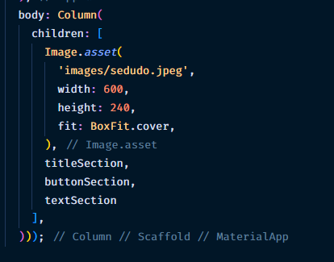
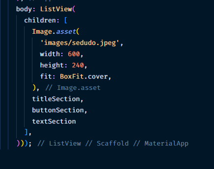
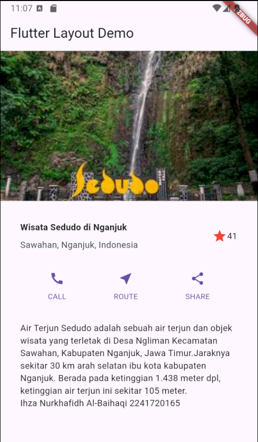
