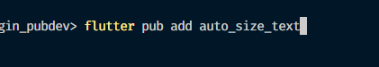
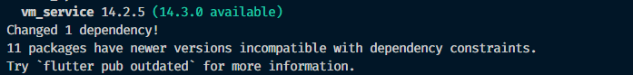
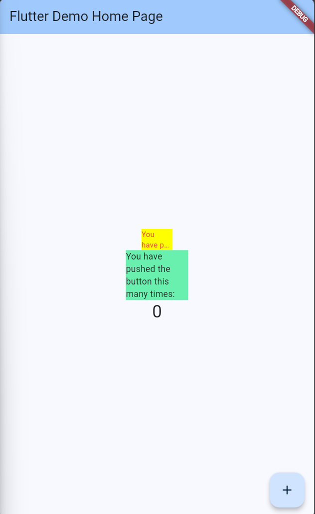

### Nama : Ihza Nurkhafidh Al-Baihaqi

### Kelas : TI 3F

### NIM : 2241720165

<br>

# Praktikum 1

1. Membuat project baru

2. Menambahkan Plugin
   
   

3. Membuat file red_text_widget.dart

   ```dart
       import 'package:flutter/material.dart';

       class RedTextWidget extends StatelessWidget {
         const RedTextWidget({Key? key}) : super(key: key);

         @override
         Widget build(BuildContext context) {
           return Container();
         }
       }
   ```

4. Menambah Widget AutoSizeText

   ```dart
   return AutoSizeText(
         text,
         style: const TextStyle(color: Colors.red, fontSize: 14),
         maxLines: 2,
         overflow: TextOverflow.ellipsis,
   );
   ```

5. Membuat Variabel text dan parameter di constructor

   ```dart
       const RedTextWidget({Key? key, required this.text}) : super(key: key);

       final String text;
   ```

6. Menambahkan widget di main.dart
   ```dart
       Container(
          color: Colors.yellowAccent,
          width: 50,
          child: const RedTextWidget(
                    text: 'You have pushed the button this many times:',
                 ),
       ),
       Container(
           color: Colors.greenAccent,
           width: 100,
           child: const Text(
                  'You have pushed the button this many times:',
                 ),
       ),
   ```
7. Hasil
   

## Jelaskan maksud dari langkah 2 pada praktikum tersebut!

langkah 2 digunakan untuk menginstall paket yang akan kita gunakan yaitu pada kasus ini "auto_size_text". Setelah diinstall, nama paket ini akan dimasukkan ke dalam file pubsec.yaml sebagai dependencies dari project ini

## Jelaskan maksud dari langkah 5 pada praktikum tersebut!

pada langkah tersebut kita membuat sebuah variable text yang dimana ini akan menampung argument yang dilempar ketika widget dipanggil. Pada line kedua kite merubah contructor dengan menambah text ke constructer, dan juga kita menambahkan keyword required dimana ini membuat text wajib diisi oleh argument

## Pada langkah 6 terdapat dua widget yang ditambahkan, jelaskan fungsi dan perbedaannya!


- kotak pertama menggunakan widget yang kita buat tadi menggunakan pluggin "auto_size_text" dengan melempar text untuk argument dari constructor

- kotak kedua menggunakan widget Text() milik flutter

## Jelaskan maksud dari tiap parameter yang ada di dalam plugin auto_size_text berdasarkan tautan pada dokumentasi ini !

- **key**: Mengatur bagaimana widget menggantikan widget lain dalam pohon widget.
- **textKey**: Menentukan kunci untuk widget teks yang dihasilkan.
- **style**: Jika tidak null, menentukan gaya teks yang akan digunakan.
- **minFontSize**: Batas minimal ukuran teks saat menyesuaikan ukuran otomatis.
- **maxFontSize**: Batas maksimal ukuran teks saat menyesuaikan ukuran otomatis.
- **stepGranularity**: Ukuran langkah yang menentukan seberapa besar perubahan ukuran font.
- **presetFontSizes**: Daftar semua ukuran font yang mungkin digunakan, harus diurutkan dari besar ke kecil.
- **group**: Mensinkronkan ukuran teks di beberapa widget AutoSizeText.
- **textAlign**: Menentukan perataan horizontal teks.
- **textDirection**: Arah teks yang menentukan bagaimana nilai textAlign seperti TextAlign.start dan TextAlign.end diinterpretasikan.
- **locale**: Digunakan untuk memilih font berdasarkan lokasi untuk karakter Unicode yang dapat dirender secara berbeda.
- **softWrap**: Menentukan apakah teks harus dibungkus pada titik putus baris lunak.
- **wrapWords**: Menentukan apakah kata-kata yang terlalu panjang untuk satu baris harus dibungkus. Defaultnya true.
- **overflow**: Menentukan bagaimana menangani teks yang meluap.
- **overflowReplacement**: Widget pengganti yang ditampilkan jika teks meluap dan tidak sesuai dengan batas.
- **textScaleFactor**: Rasio skala untuk ukuran teks yang mempengaruhi minFontSize, maxFontSize, dan presetFontSizes.
- **maxLines**: Batas maksimal jumlah baris teks yang dapat ditampilkan.
- **semanticsLabel**: Label semantik alternatif untuk teks ini.
