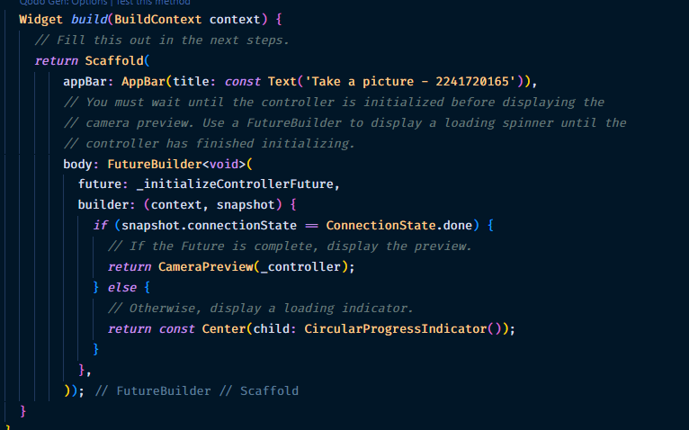

### Nama: Ihza Nurkhafidh Al-Baihaqi

### Kelas: TI 3F

### Absen: 11

### NIM: 2241720165

# Praktikum 1

1. Buat project baru
2. Tambah dependency yang diperlukan

   ```
   flutter pub add camera path_provider path
   ```

3. Ambil Sensor Kamera dari device
   

4. Buat dan inisialisasi CameraController
   
   

5. Gunakan CameraPreview untuk menampilkan preview foto
   

6. Ambil foto dengan CameraController
   

7. Buat widget baru DisplayPictureScreen
   

8. Edit main.dart
   

9. Menampilkan hasil foto
   
   
   

# Praktikum 2

1. Buat project baru
2. Buat widget Selector ring dan dark gradient
3. Buat widget photo filter carousel
4. Membuat filter warna - bagian 1
5. Membuat filter warna
6. Implementasi filter carousel
7. Hasil
   

# Tugas

Gabungkan hasil praktikum 1 dengan hasil praktikum 2 sehingga setelah melakukan pengambilan foto, dapat dibuat filter carouselnya!

1. disini kita akan menggunakan praktikum 2
2. install dependencies yang digunakan di praktikum 1
   ```
   flutter pub add camera path_provider path
   ```
3. sesuaikan dependencies

4. Lalu, sesuaikan widget filter_carousel.dart agar dapat menerima path image dari hasil tangkapan kamera.
   
   
   

5. Kemudian, salin widget takepicture_screen.dart pada praktikum 1 ke praktikum 2 dan sesuaikan agar dapat mengirim foto hasil tangkapan ke page PhotoFilterCarousel.
   
   
   
   

### void async

yaitu fungsi yang berjalan secara asynchronous. async diperlukan jika kita ingin menggunakan await di dalam fungsi tersebut. await sendiri digunakan untuk menunggu operasi asynchronous selesai, seperti request API, dll.

### Fungsi dari anotasi @immutable dan @override ?

- @immutable, menandakan bahwa sebuah class tidak dapat diubah (immutable) setelah dibuat. Semua field dalam class tersebut harus final. Biasanya digunakan pada class yang menyimpan state. Dapat membantu mencegah perubahan yang tidak diinginkan pada data.
- @override, menandakan bahwa method tersebut menimpa (override) method dari superclass/parent class.
