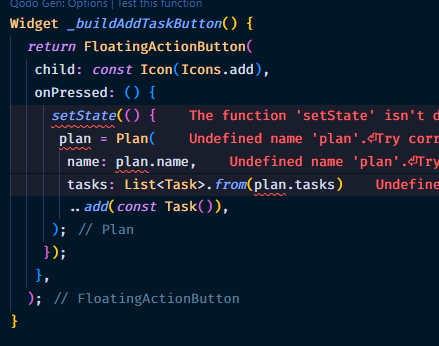
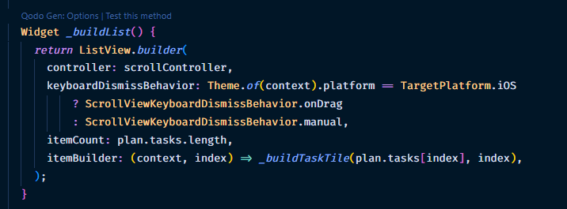
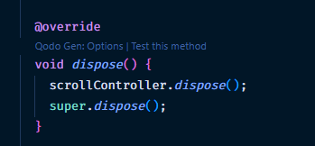
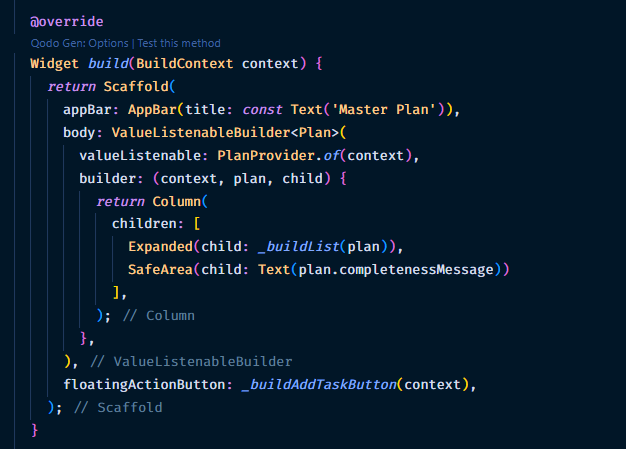

### Nama: Ihza Nurkhafidh Al-Baihaqi

### Kelas: TI 3F

### Absen: 11

### NIM: 2241720165

# Praktikum 1

1. Membuat Project Baru
2. Membuat model `task.dart`
   
3. Buat file `plan.dart`
   
4. Buat file `data_layer.dart`
   
5. Pindah ke file main.dart
   
6. Buat `plan_screen.dart`
   
7. Buat method `_buildAddTaskButton()`
   
8. Buat widget `_buildList()`
   
9. Buat widget `_buildTaskTile`
   
10. Tambah Scroll Controller
    
11. Tambah Scroll Listener
    
12. Tambah controller dan keyboard behavior
    
13. Terakhir, tambah method `dispose()`
    
14. Hasil
    

## Tugas 1

1.  Jelaskan maksud dari langkah 4 pada praktikum tersebut! Mengapa dilakukan demikian?

Jawab : Agar proses import pada beberapa model dapat menjadi lebih ringkas dengan mengimport data_layer.dart saja.

2. Mengapa perlu variabel plan di langkah 6 pada praktikum tersebut? Mengapa dibuat konstanta ?
   Jawab : Variabel plan digunakan untuk menyimpan state model Plan.Plan sendiri sepertinya adalah sebuah model data yang berisi nama rencana dan daftar tugas (tasks). Variabel ini diperlukan agar widget dapat mengelola dan memperbarui data rencana secara reaktif. Ketika ada perubahan pada plan (misalnya saat menambah task baru), widget akan di-rebuild untuk menampilkan data terbaru.

3. Mengapa dibuat konstanta? const pada inisialisasi awal hanya untuk optimasi. Variabel plan sendiri tidak final/const karena nilainya akan diubah kemudian saat menambahkan plan baru.
   Lakukan capture hasil dari Langkah 9 berupa GIF, kemudian jelaskan apa yang telah Anda buat!
   

# Praktikum 2

1. Buat file `plan_provider.dart`
   
2. Edit `main.dart`
   
3. Tambah method pada model `plan.dart`
   
4. Pindah ke PlanScreen
5. Edit method `_buildAddTaskButton`
   
6. Edit method `_buildTaskTile`
   
7. Edit `_buildList`
   
8. Tetap di class PlanScreen
9. Tambah widget SafeArea
   
10. Hasil
   
