### Nama: Ihza Nurkhafidh Al-Baihaqi

### Kelas: TI 3F

### NIM: 2241720165

### Absen: 11

# Praktikum 1

1. Buat Project Baru dan tambahkan dependency `http` <br>
2. Cek file `pubspec.yaml`<br>
   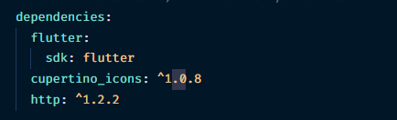
3. Buka file `main.dart`<br>

   ```dart
    import 'package:flutter/material.dart';
    import 'package:http/http.dart' as http;
    import 'package:http/http.dart';

    void main() {
    runApp(const MyApp());
    }

    class MyApp extends StatelessWidget {
    const MyApp({super.key});

    @override
    Widget build(BuildContext context) {
        return MaterialApp(
        title: 'Flutter Demo',
        theme: ThemeData(
            primarySwatch: Colors.blue,
            visualDensity: VisualDensity.adaptivePlatformDensity),
        home: const FuturePage(),
        );
    }
    }

    class FuturePage extends StatefulWidget {
    const FuturePage({super.key});

    @override
    State<FuturePage> createState() => _FuturePageState();
    }

    class _FuturePageState extends State<FuturePage> {
    String result = '';

    @override
    Widget build(BuildContext context) {
        return Scaffold(
        appBar: AppBar(
            backgroundColor: Theme.of(context).colorScheme.inversePrimary,
            title: const Text('Back from the future'),
        ),
        body: Center(
            child: Column(mainAxisAlignment: MainAxisAlignment.center, children: [
            const Spacer(),
            ElevatedButton(
                child: const Text('GO!'),
                onPressed: () {},
            ),
            const Spacer(),
            Text(result),
            const Spacer(),
            const CircularProgressIndicator(),
            const Spacer(),
            ]),
        ),
        );
    }
    }

   ```

4. Tambah method `getData()`<br>

   ```dart

       Future<Response> getData() async {
           const authority = 'www.googleapis.com';
           const path = '/books/v1/volumes/junbDwAAQBAJ';
           Uri url = Uri.https(authority, path);
           return http.get(url);
       }
   ```

5. Tambah kode di `ElevatedButton`<br>

   ```dart
   ElevatedButton(
               child: const Text('GO!'),
               onPressed: () {
               setState(() {});
               getData().then((value) {
                   result = value.body.toString().substring(0, 450);
                   setState(() {});
               }).catchError((_) {
                   result = 'An error occured';
                   setState(() {});
               });
               },
           ),
   ```

6. hasil <br>
   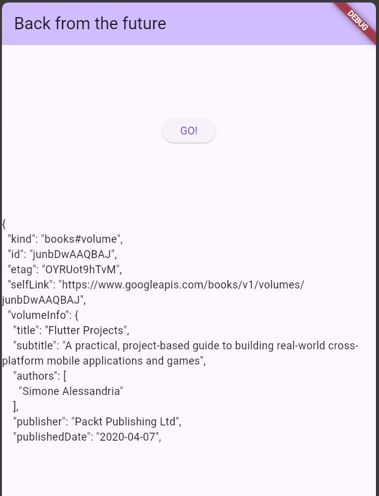

7. Soal 2 <br>
   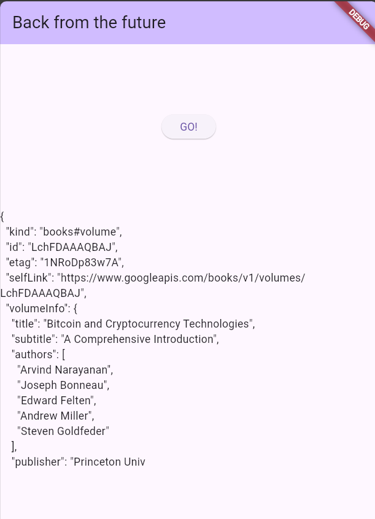
8. Soal 3 <br>
   Jawab: `substring` digunakan untuk mengambil data dari index tertentu pada string. catchError digunakan untuk menangkap error jika terjadi pada kode.

# Praktikum 2

1.  Buka file `main.dart` <br>

    ```dart
    Future<int> returnOneAsync() async {
    await Future.delayed(const Duration(seconds: 3));
    return 1;
    }

    Future<int> returnTwoAsync() async {
    await Future.delayed(const Duration(seconds: 3));
    return 2;
    }

    Future<int> returnThreeAsync() async {
    await Future.delayed(const Duration(seconds: 3));
    return 3;
    }
    ```

2.  Tambah method `count()`<br>
    ```dart
    Future count() async {
        int total = 0;
        total += await returnOneAsync();
        total += await returnTwoAsync();
        total += await returnThreeAsync();
        setState(() {
        result = total.toString();
        });
    }
    ```
3.  Panggil `count()`<br>
    ```dart
    ElevatedButton(
            child: const Text('GO!'),
            onPressed: () {
              count();
            },
          ),
    ```
4.  Run <br>
    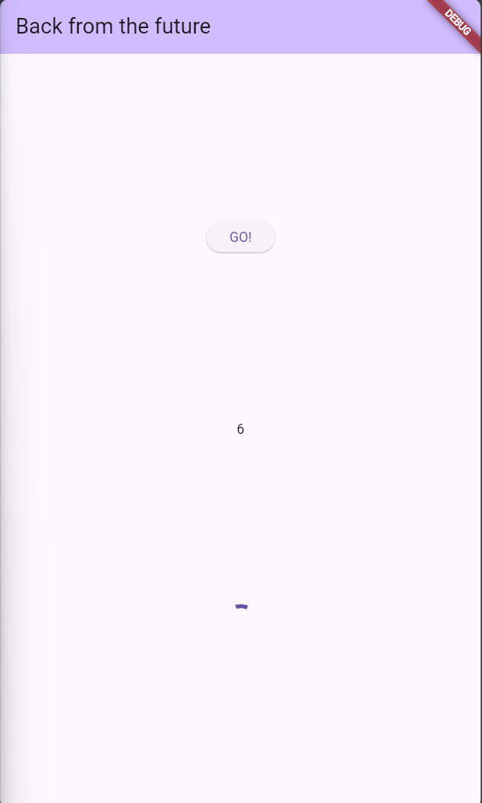

5.  Soal 4
    Jawab: Kode pada langkah 1 merupakan kode yang akan mengembalikan nilai 1,2,3 dengan delay 3 detik. Kode langkah 2 adalah kode yang akan menjalankan kode langkah 1 dan menampilkan hasilnya.

# Praktikum 3

1. Buka main.dart <br>

   ```dart
    import 'package:async/async.dart';
   ```

2. Tambahkan variabel dan method <br>

```dart
  late Completer completer;

  Future getNumber() {
    completer = Completer<int>();
    calculate();
    return completer.future;
  }

  Future calculate() async {
    await Future.delayed(const Duration(seconds: 5));
    completer.complete(42);
  }

```

3.  Ganti isi kode `onPressed()` <br>
    ```dart
    getNumber().then((value){
                    setState(() {
                    result = value.toString();
                    });
                });
    ```
4.  Run <br>
    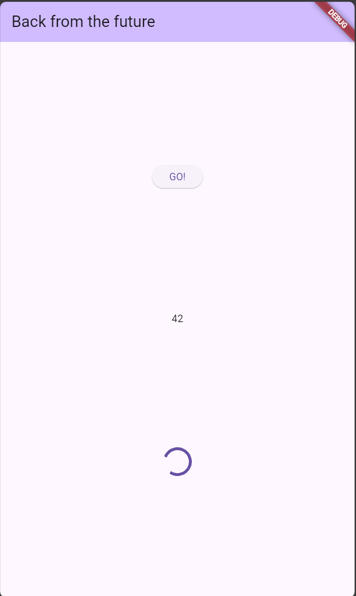
5.  Ganti method `calculate()` <br>
    ```dart
    calculate() async {
        // await Future.delayed(const Duration(seconds: 5));
        // completer.complete(42);
        try {
        await new Future.delayed(const Duration(seconds: 5));
        completer.complete(42);
        } catch (_) {
        completer.completeError({});
        }
    }
    ```
6.  Pindah ke `onPressed()` <br>

    ```dart
                getNumber().then((value){
                    setState(() {
                    result = value.toString();
                    });
                }).catchError((e){
                    result = 'An error occured';
                });
    ```

7.  Soal 5 <br>
    Jawab: Kode tersebut menggunakan Completer untuk mengelola penyelesaian (completion) dari sebuah Future secara manual. Mendeklarasikan variabel completer dengan keyword late, yang berarti variabel akan diinisialisasi nanti sebelum digunakan. Fungsi `getNumber()` membuat instance baru dari `Completer<int>()`. Memanggil fungsi calculate() yang akan menyelesaikan Completer tersebut. Mengembalikan `completer.future`, yaitu sebuah Future yang akan berisi nilai ketika completer selesai (complete).
    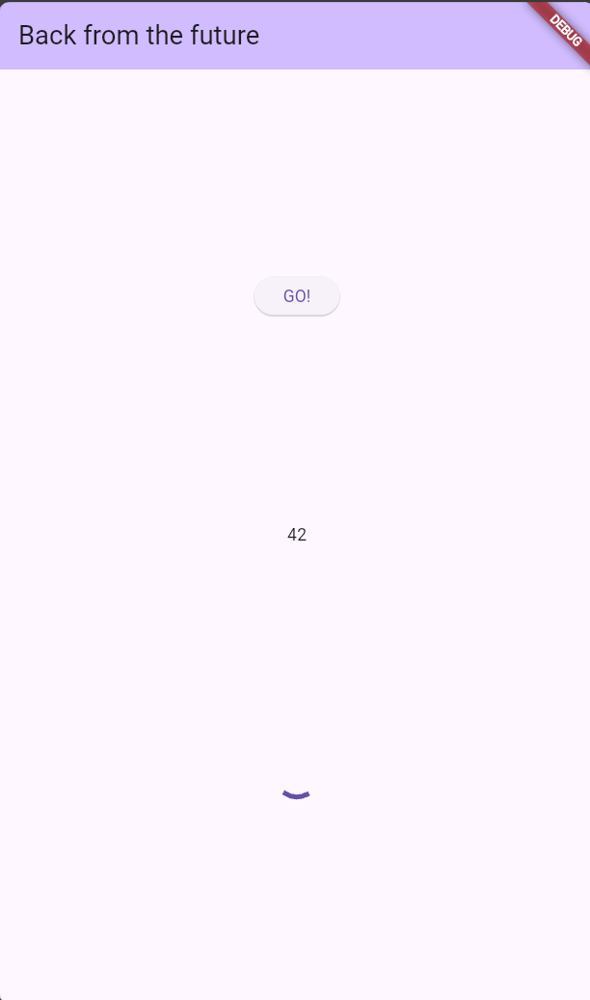

8.  Soal 6 <br>
    Jawab: Kode langkah 2 menggunakan Completer untuk mengelola penyelesaian (completion) dari sebuah Future secara manual tanpa melakukan handle jika terjadi error. Sedangkan kode langkah 5-6 menggunakan Completer dengan Future.delayed untuk menunda eksekusi kode selama 5 detik dan menerapkan try-catch untuk menangkap error yang terjadi dan `completer.completeError()` untuk menyelesaikan `Completer` dengan error.

# Praktikum 4

1. Buka file `main.dart` <br>

   ```dart
   void returnFG(){
       FutureGroup<int> futureGroup = FutureGroup<int>();
       futureGroup.add(returnOneAsync());
       futureGroup.add(returnTwoAsync());
       futureGroup.add(returnThreeAsync());
       futureGroup.close();
       futureGroup.future.then((List <int>value){
       int total = 0;
       for (var element in value) {
           total += element;
       }

       setState(() {
           result = total.toString();
       });
       });
   }
   ```

2. Edit `onPressed()` <br>
   ```dart
   ElevatedButton(
               child: const Text('GO!'),
               onPressed: () {
               returnFG();
               },
           ),
   ```
3. Run (Soal 4)<br>
   Hasilnya dalam 3 detik berupa angka 6 lebih cepat dibandingkan praktikum sebelumnya menunggu sampai 9 detik. <br>
   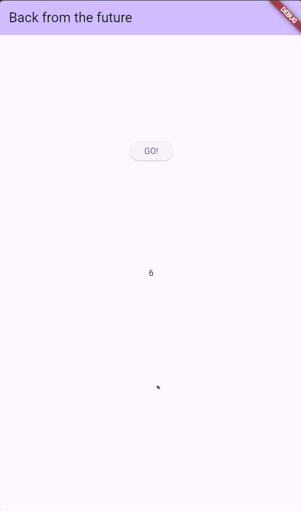
4. anti variabel `futureGroup` <br>

   ```dart
   void returnFG() {
       final futures = Future.wait<int>([
       returnOneAsync(),
       returnTwoAsync(),
       returnThreeAsync(),
       ]);
       futures.then((List<int> value) {
       int total = 0;
       for (var element in value) {
           total += element;
       }

       setState(() {
           result = total.toString();
       });
       });
   }
   ```

5. Soal 8
   Jawab: Kode langkah 1 menggunakan FutureGroup untuk mengelola beberapa Future secara paralel. Sedangkan kode langkah 4 menggunakan Future.wait untuk menjalankan beberapa Future secara paralel dan mengembalikan Future yang akan menyelesaikan ketika semua Future selesai.
   Keduanya digunakan untuk menunggu beberapa Future selesai, tetapi FutureGroup memberikan fleksibilitas lebih dalam menambahkan Future secara dinamis

# Praktikum 5

1. Buka file `main.dart` <br>
   ```dart
   Future returnError() async {
       await Future.delayed(const Duration(seconds: 2));
       throw Exception('Something terrible happened!');
   }
   ```
2. `ElevatedButton` <br>
   ```dart
   ElevatedButton(
               child: const Text('GO!'),
               onPressed: () {
               returnError().then((value) {
                   setState(() {
                   result = 'Success';
                   });
               }).catchError((onError) {
                   setState(() {
                   result = onError.toString();
                   });
               }).whenComplete(() => print('Compleete'));
               },
           ),
   ```
3. Run <br>
   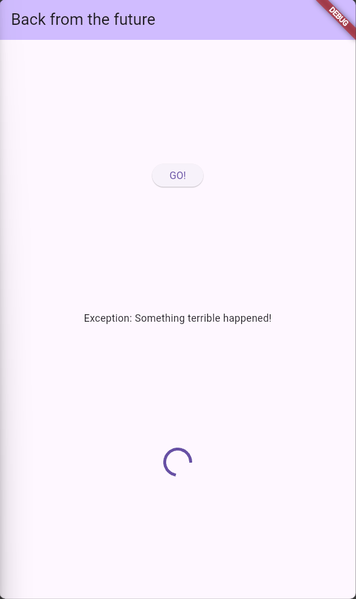
4. Tambah method `handleError()` <br>
   ```dart
   Future handleError() async {
       try {
       await returnError();
       } catch (error) {
       setState(() {
           result = error.toString();
       });
       } finally {
       print('Complete');
       }
   }
   ```
5. Soal 10
   Jawab: Hasilnya akan menampilkan complete pada console. Perbedaan kode langkah 1 dan 4 adalah kode langkah 1 menggunakan catchError untuk menangkap error yang terjadi pada kode dan onComplete untuk menampilkan hasilnya di console. Sedangkan kode langkah 4 menggunakan try-catch pada method returnError untuk menangkap error yang terjadi dan menggunakan finally untuk menampilkan hasilnya di console.

# Praktikum 6

1. install plugin `geolocator` <br>
   `flutter pub add geolocator`
2. Tambah permission GPS <br>
   `<uses-permission android:name="android.permission.ACCESS_FINE_LOCATION"/>
<uses-permission android:name="android.permission.ACCESS_COARSE_LOCATION"/>`

3. Buat file `geolocation.dart` <br>
4. Buat `StatefulWidget` <br>
5. Isi kode `geolocation.dart` <br>

   ```dart
   import 'package:flutter/material.dart';
   import 'package:geolocator/geolocator.dart';

   class LocationScreen extends StatefulWidget {
   const LocationScreen({super.key});

   @override
   State<LocationScreen> createState() => _LocationScreenState();
   }

   class _LocationScreenState extends State<LocationScreen> {
   String myPosition = '';
   Future<Position>? position;
   @override
   void initState() {
       super.initState();
       position = getPosition();
   }

   @override
   Widget build(BuildContext context) {
       return Scaffold(
       appBar: AppBar(
           title: const Text("2241720162 - Ridho Aulia' Rahman"),
       ),
       body: Center(
           child: FutureBuilder(
           future: position,
           builder: (BuildContext contex, AsyncSnapshot<Position> snapshot) {
               if (snapshot.connectionState == ConnectionState.waiting) {
               return const CircularProgressIndicator();
               } else if (snapshot.connectionState == ConnectionState.done) {
               if (snapshot.hasError) {
                   return const Text('Something terrible happened!');
               }
               return Text(snapshot.data.toString());
               } else {
               return const Text('');
               }
           },
           ),
       ),
       );
   }

   Future<Position> getPosition() async {
       await Geolocator.requestPermission();
       await Geolocator.isLocationServiceEnabled();
       await Future.delayed(const Duration(seconds: 3));
       Position position = await Geolocator.getCurrentPosition();
       return position;
   }
   }
   ```

6. Edit `main.dart`
   ```dart
   return MaterialApp(
       title: 'Flutter Demo',
       theme: ThemeData(
           primarySwatch: Colors.blue,
           visualDensity: VisualDensity.adaptivePlatformDensity),
       // home: const FuturePage(),
       home: const LocationScreen(),
       );
   ```
7. Run <br>
   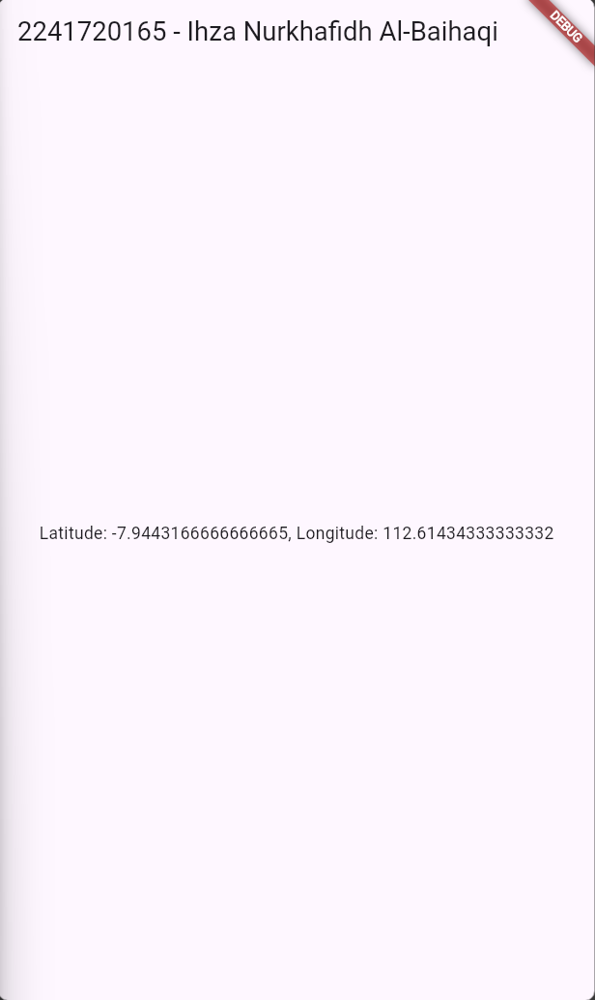
8. Tambahkan animasi loading <br>

# Praktikum 7

1. Modifikasi method `getPosition()`
   ```dart
   Future<Position> getPosition() async {
       await Geolocator.requestPermission();
       await Geolocator.isLocationServiceEnabled();
       await Future.delayed(const Duration(seconds: 3));
       Position position = await Geolocator.getCurrentPosition();
       return position;
   }
   ```
2. Tambah variabel
   ```dart
   Future<Position>? position;
   ```
3. Tambah `initState()`
   ```dart
   void initState() {
       super.initState();
       position = getPosition();
   }
   ```
4. Edit method `build()`
   ```dart
   @override
   Widget build(BuildContext context) {
       return Scaffold(
       appBar: AppBar(
           title: const Text("2241720165 - Ihza Nurkhafidh Al-Baihaqi"),
       ),
       body: Center(
           child: FutureBuilder(
           future: position,
           builder: (BuildContext contex, AsyncSnapshot<Position> snapshot) {
               if (snapshot.connectionState == ConnectionState.waiting) {
               return const CircularProgressIndicator();
               } else if (snapshot.connectionState == ConnectionState.done) {
               if (snapshot.hasError) {
                   return const Text('Something terrible happened!');
               }
               return Text(snapshot.data.toString());
               } else {
               return const Text('');
               }
           },
           ),
       ),
       );
   }
   ```
5. Tambah handling error
   ```dart
   else if (snapshot.connectionState == ConnectionState.done) {
               if (snapshot.hasError) {
                   return const Text('Something terrible happened!');
               }
               return Text(snapshot.data.toString());
               }
   ```

# Praktikum 8

1. Buat file baru `navigation_first.dart` <br>
2. Isi kode `navigation_first.dart` <br>

   ```dart
   import 'package:flutter/material.dart';

   class NavigationFirst extends StatefulWidget {
   const NavigationFirst({super.key});

   @override
   State<NavigationFirst> createState() => _NavigationFirstState();
   }

   class _NavigationFirstState extends State<NavigationFirst> {
   Color color = Colors.deepOrange.shade400;
   @override
   Widget build(BuildContext context) {
       return Scaffold(
       backgroundColor: color,
       appBar: AppBar(
           title: const Text("2241720165 - Ihza Nurkhafidh Al-Baihaqi"),
       ),
       body: Center(
           child: ElevatedButton(
           onPressed: () {
               _navigateAndGetColor(context);
           },
           child: const Text('Change Color'),
           ),
       ),
       );
   }
   }
   ```

3. Langkah 3: Tambah method di `class _NavigationFirstState` <br>
   ```dart
   Future _navigateAndGetColor(BuildContext context) async {
       color = await Navigator.push(
           context,
           MaterialPageRoute(builder: (context) => const NavigationSecond()),
           ) ??
           Colors.blue;
       setState(() {});
   }
   ```
4. Langkah 4: Buat file baru `navigation_second.dart` <br>

   ```dart
       import 'package:flutter/material.dart';

       class NavigationSecond extends StatefulWidget {
       const NavigationSecond({super.key});

       @override
       State<NavigationSecond> createState() => _NavigationSecondState();
       }

       class _NavigationSecondState extends State<NavigationSecond> {
       @override
       Widget build(BuildContext context) {
           Color color;
           return Scaffold(
           appBar: AppBar(
               title: const Text("Navigation Second Screen"),
           ),
           body: Center(
               child: Column(
               children: [
                   ElevatedButton(
                   child: const Text('Red'),
                   onPressed: () {
                       color = Colors.red.shade700;
                       Navigator.pop(context, color);
                   },
                   ),
                   ElevatedButton(
                   child: const Text('Green'),
                   onPressed: () {
                       color = Colors.green.shade700;
                       Navigator.pop(context, color);
                   },
                   ),
                   ElevatedButton(
                   child: const Text('Blue'),
                   onPressed: () {
                       color = Colors.blue.shade700;
                       Navigator.pop(context, color);
                   },
                   ),
               ],
               ),
           ),
           );
       }
       }
   ```

5. Buat class NavigationSecond dengan `StatefulWidget` <br>
6. Edit `main.dart` <br>
   ```dart
       home: const NavigationFirst(),
   ```
7. Run <br>
8. Soal 16 <br>
   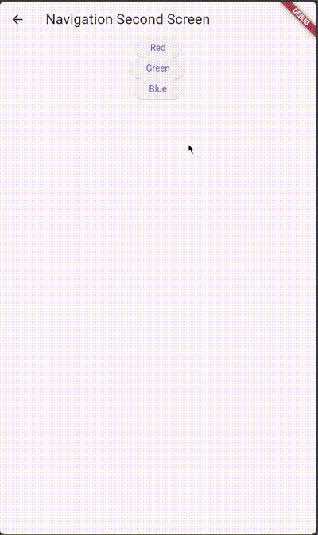

# Praktikum 9

1. Buat file baru `navigation_dialog.dart` <br>
2. Isi kode `navigation_dialog.dart` <br>

   ```dart
   import 'package:flutter/material.dart';

   class NavigationDialogScreen extends StatefulWidget {
   const NavigationDialogScreen({super.key});

   @override
   State<NavigationDialogScreen> createState() => _NavigationDialogScreenState();
   }

   class _NavigationDialogScreenState extends State<NavigationDialogScreen> {
   Color color = Colors.blue.shade700;

   @override
   Widget build(BuildContext context) {
       return Scaffold(
       backgroundColor: color,
       appBar: AppBar(
           title: const Text("2241720165 - Ihza Nurkhafidh Al-Baihaqi"),
       ),
       body: Center(
           child: ElevatedButton(
           onPressed: () {
               _showColorDialog(context);
           },
           child: const Text('Change Color'),
           ),
       ),
       );
   }
   }
   ```

3. Tambah method `async` <br>
   ```dart
   _showColorDialog(BuildContext context) {
       showDialog(
       barrierDismissible: false,
       context: context,
       builder: (_) {
           return AlertDialog(
           title: const Text('Very important question'),
           content: const Text('Please choose a color'),
           actions: <Widget>[
               TextButton(
               onPressed: () {
                   color = Colors.deepPurple.shade700;
                   setState(() {});
                   Navigator.pop(context, color);
               },
               child: const Text('Purple'),
               ),
               TextButton(
               onPressed: () {
                   color = Colors.yellow.shade700;
                   setState(() {});
                   Navigator.pop(context, color);
               },
               child: const Text('Yellow'),
               ),
               TextButton(
               onPressed: () {
                   color = Colors.blue.shade700;
                   setState(() {});
                   Navigator.pop(context, color);
               },
               child: const Text('Blue'),
               ),
           ],
           );
       },
       );
   }
   ```
4. Panggil method di `ElevatedButton` <br>
   ```dart
   child: ElevatedButton(
           onPressed: () {
               _showColorDialog(context);
           },
           child: const Text('Change Color'),
           ),
   ```
5. Edit `main.dart` <br>
   ```dart
   home: const NavigationDialogScreen(),
   ```
6. Run <br>
7. SOal 17 <br>
   Jawab: Ketika button change color diklik, maka akan menampilkan dialog yang berisi 3 button yang masing-masing akan mengubah warna background pada halaman pertama.
   Mengganti warna menjadi warna favorit.

   ```dart
    _showColorDialog(BuildContext context) {
        showDialog(
        barrierDismissible: false,
        context: context,
        builder: (_) {
            return AlertDialog(
            title: const Text('Very important question'),
            content: const Text('Please choose a color'),
            actions: <Widget>[
                TextButton(
                onPressed: () {
                    color = Colors.deepPurple.shade700;
                    setState(() {});
                    Navigator.pop(context, color);
                },
                child: const Text('Purple'),
                ),
                TextButton(
                onPressed: () {
                    color = Colors.yellow.shade700;
                    setState(() {});
                    Navigator.pop(context, color);
                },
                child: const Text('Yellow'),
                ),
                TextButton(
                onPressed: () {
                    color = Colors.blue.shade700;
                    setState(() {});
                    Navigator.pop(context, color);
                },
                child: const Text('Blue'),
                ),
            ],
            );
        },
        );
    }
   ```

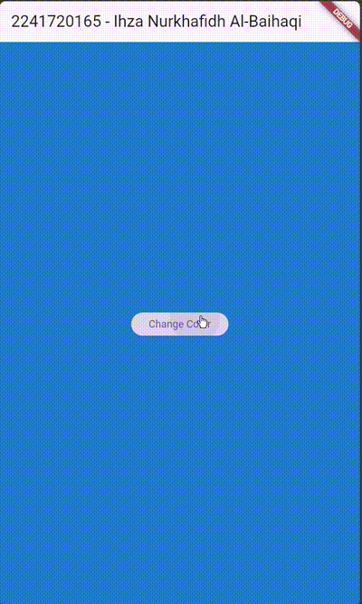
