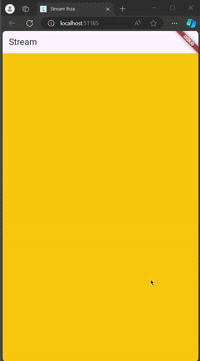
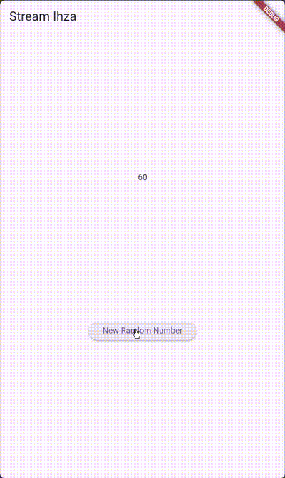
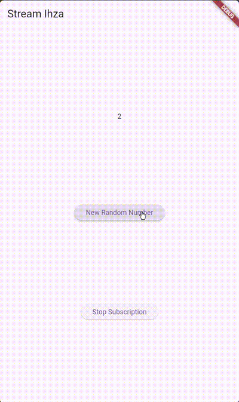
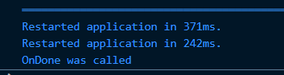
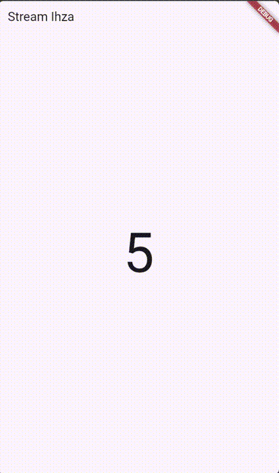
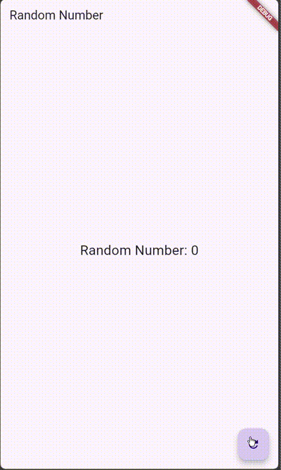

### Nama: Ihza Nurkhafidh Al-Baihaqi

### Kelas: TI 3F

### Absen: 2241720165

### NIM: 2241720165

# Praktikum 1

1. Buat project baru
2. Soal 1

   ```dart
   Widget build(BuildContext context) {
       return MaterialApp(
         title: 'Stream Ihza',
         theme: ThemeData(
           colorScheme: ColorScheme.fromSeed(seedColor: Colors.deepPurple),
           useMaterial3: true,
         ),
         home: const MyHomePage(title: 'Flutter Demo Home Page'),
       );
     }
   ```

3. Buat file baru `stream.dart`

   ```dart
   import 'package:flutter/material.dart';
   class ColorStream {

   }
   ```

4. Tambah variabel colors dan Soal 2
   ```dart
   final List<Color> colors = [
        Colors.blueGrey,
        Colors.amber,
        Colors.deepPurple,
        Colors.lightBlue,
        Colors.teal,
        Colors.blueAccent,
        Colors.amberAccent,
        Colors.deepOrange,
        Colors.lightGreen,
        Colors.red,
     ];
   ```
5. Tambah method `getColors()`

   ```dart
     Stream<Color> getColors() async* {

     }
   ```

6. Tambah perintah `yield*` dan Soal 3

   ```dart
   yield* Stream.periodic(
     const Duration(seconds: 1), (int t) {
       int index = t % colors.length;
       return colors[index];
   });
   ```

   yield digunakan untuk mengenerate value ketika function dipanggil kembali, konsep ini dijavascript biasa disebut sebagai function generator.

7. Buka `main.dart`
   ```dart
   import 'stream.dart';
   ```
8. Tambah variabel
   ```dart
     Color bgColor = Colors.blueGrey;
     late ColorStream colorStream;
   ```
9. Tambah method `changeColor()`
   ```dart
     void changeColort() async {
       await for (var eventCOlor in colorStream.getColors()) {
         setState(() {
           bgColor = eventCOlor;
         });
       }
     }
   ```
10. Lakukan override `initState()`
    ```dart
    @override
    void initState() {
        super.initState();
        colorStream = ColorStream();
        changeColort();
    }
    ```
11. Ubah isi `Scaffold()`

    ```dart
    Widget build(BuildContext context) {
        return Scaffold(
            appBar: AppBar(
            title: const Text('Stream'),
            ),
            body: Container(
            decoration: BoxDecoration(color: bgColor),
            )
        );
    }
    ```

12.Run dan Soal 4 <br>


13. Ganti isi method `changeColor()` dan Soal 5

    ```dart
    void changeColor() async {
        colorStream.getColors().listen((eventColor){
        setState(() {
            bgColor = eventColor;
        });
        });
    }
    ```

    Kedua potongan kode di atas digunakan untuk mengubah warna latar belakang (`background color`) secara asinkron berdasarkan nilai yang diterima dari sebuah stream (`colorStream`). Namun, terdapat perbedaan mendasar dalam cara kedua pendekatan ini menangani stream.

    Pada kode sebelumnya, fungsi `changeColor` menggunakan `await for`. Pendekatan ini menunggu setiap event yang diterima dari stream satu per satu dalam urutan tertentu. Setiap kali ada data baru (`eventColor`), kode di dalam blok `setState` akan dijalankan untuk memperbarui warna latar belakang. Pendekatan ini cocok jika Anda ingin memproses setiap item secara sinkron dan memastikan operasi selesai sebelum melanjutkan ke item berikutnya.

    Pada kode ini, fungsi `changeColor` menggunakan metode `listen`. Di sini, alih-alih menunggu setiap event selesai diproses, fungsi langsung memulai mendengarkan stream. Setiap kali ada event baru, callback di dalam `listen` akan dieksekusi untuk memperbarui warna latar belakang. Pendekatan ini lebih fleksibel karena memungkinkan penanganan event yang bersifat non-blocking dan cocok untuk alur yang memerlukan respons cepat tanpa menunggu penyelesaian operasi sebelumnya.

# Praktikum 2

1. Buka file `stream.dart`

```dart
import 'dart:async';
```

2. Tambah `class NumberStream`

```dart
class NumberStream {
}
```

3. Tambah `StreamController`

```dart
  final StreamController<int> controller = StreamController<int>();
```

4. Tambah method `addNumberToSink`

```dart
  void addNumnerToSink(int newNumber){
    controller.sink.add(newNumber);
  }
```

5. Tambah method `close()`

```dart
  void close(){
    controller.close();
  }
```

6. Buka `main.dart`

```dart
import 'dart:async';
import 'dart:math';
```

7. Tambah variabel

```dart
  int lastNumber = 0;
  late StreamController numberStreamController;
  late NumberStream numberStream;
```

8. Edit `initState()`

```dart
  @override
  void initState() {
    numberStream = NumberStream();
    numberStreamController = numberStream.controller;
    Stream stream = numberStreamController.stream;
    stream.listen((event) {
      setState(() {
        lastNumber = event;
      });
    });
  }
```

9. Edit `dispose()`

```dart
  void dispose() {
    numberStreamController.close();
    super.dispose();
  }
```

10. Tambah method `addRandomNumber()`

```dart
  void addRandomNumber(){
    Random random = Random();
    int myNum = random.nextInt(10);
    numberStream.addNumberToSink(myNum);
  }
```

11. Edit method `build()`

```dart
body: SizedBox(
          width: double.infinity,
          child: Column(
            mainAxisAlignment: MainAxisAlignment.spaceEvenly,
            crossAxisAlignment: CrossAxisAlignment.center,
            children: [
              Text(lastNumber.toString()),
              ElevatedButton(
                  onPressed: addRandomNumber,
                  child: const Text('New Random Number'))
            ],
          ),
        )
```

12. Run dan Soal 6 <br>
    
13. Buka `stream.dart`

```dart
  void addError(){
    controller.sink.addError('error');
  }
```

14. Buka `main.dart`

```dart
  void onError() {
    Stream stream = numberStreamController.stream;
    stream.listen((event) {
      setState(() {
        lastNumber = event;
      });
    }).onError((error) {
      setState(() {
        lastNumber = -1;
      });
    });
  }
```

15. Edit method `addRandomNumber()`

```dart
  void addRandomNumber() {
    Random random = Random();
    // int myNum = random.nextInt(10);
    // numberStream.addNumberToSink(myNum);
    numberStream.addError();
  }
```

16. Soal 7
    pada langkah 13-15 berguna untuk memberikan error pada kode dengan cara menggunakan `addError()`

# Praktikum 3

1. Buka `main.dart`

```dart
  late StreamTransformer transformer;
```

2. Tambahkan kode ini di `initState`

```dart
  @override
  void initState() {
    numberStream = NumberStream();
    numberStreamController = numberStream.controller;
    Stream stream = numberStreamController.stream;
    // stream.listen((event) {
    //   setState(() {
    //     lastNumber = event;
    //   });
    // });

    transformer = StreamTransformer<int, int>.fromHandlers(
        handleData: (value, sink) {
          sink.add(value * 10);
        },
        handleError: (error, trace, sink) {
          sink.add(-1);
        },
        handleDone: (sink) => sink.close());
  }
```

3. Tetap di `initState`

```dart
    stream.transform(transformer).listen((event) {
      setState(() {
        lastNumber = event;
      });
    }).onError((error) {
      setState(() {
        lastNumber = -1;
      });
    });
    super.initState();
```

4. Run dan Soal 8 <br>
   

# Praktikum 4

1. Tambah variabel

   ```dart
    late StreamSubscription subscription;
   ```

2. Edit `initState()`

   ```dart
    @override
    void initState() {
        numberStream = NumberStream();
        numberStreamController = numberStream.controller;
        Stream stream = numberStreamController.stream;
        stream.listen((event) {
        setState(() {
            lastNumber = event;
        });
        });
        super.initState();
    }
   ```

3. Tetap di `initState()`

   ```dart
        subscription.onError((error){
        setState(() {
            lastNumber = -1;
          });
        });
   ```

4. Tambah properti `onDone()`

   ```dart
       subscription.onDone((){
      print('OnDone was called')''
    });
   ```

5. Tambah method baru

   ```dart
    void stopStream(){
        numberStreamController.close();
    }
   ```

6. Pindah ke method `dispose()`

   ```dart
    @override
    void dispose() {
        subscription.cancel();
    }
   ```

7. Pindah ke method `build()`

   ```dart
    ElevatedButton(
                  onPressed: () => stopStream(),
                  child: const Text('Stop Subscription'))
   ```

8. Edit method `addRandomNumber()`

   ```dart
        void addRandomNumber() {
        Random random = Random();
        int myNum = random.nextInt(10);
        if (!numberStreamController.isClosed) {
          numberStream.addNumberToSink(myNum);
        } else {
          setState(() {
            lastNumber = -1;
          });
        }
      }
   ```

9. Run
10. Tekan button ‘Stop Subscription'
11. Soal 9
    Kode di atas merupakan implementasi penggunaan stream untuk mengelola aliran data secara asinkron dalam aplikasi Flutter. Berikut adalah penjelasan tiap bagian:

    1. initState: Pada fungsi ini, objek NumberStream dibuat dan dihubungkan dengan StreamController. Sebuah Stream kemudian diperoleh dari controller tersebut, dan listener (melalui stream.listen) ditambahkan untuk mendengarkan setiap event yang masuk ke stream. Setiap kali event diterima, nilai event akan diperbarui ke variabel lastNumber menggunakan setState, sehingga tampilan dapat diperbarui.

    2. dispose: Dalam metode ini, proses pembersihan (clean-up) dilakukan. Listener pada stream (subscription) dihentikan dengan subscription.cancel untuk menghindari kebocoran memori (memory leaks). Jika ada bagian kode yang membuka controller di masa depan, Anda perlu memastikan untuk menutupnya menggunakan numberStreamController.close() di sini.

    3. addRandomNumber: Fungsi ini digunakan untuk menambahkan angka acak ke stream. Angka acak dihasilkan menggunakan Random().nextInt(10), kemudian ditambahkan ke stream melalui metode addNumberToSink dari NumberStream, tetapi hanya jika controller belum ditutup (!numberStreamController.isClosed). Jika controller sudah ditutup, variabel lastNumber diatur ke nilai -1, menandakan bahwa data tidak dapat ditambahkan lagi. Komentar numberStream.addError() menunjukkan bahwa ada opsi untuk menambahkan error ke stream, tetapi belum diaktifkan.

    Kode ini menggambarkan pola penggunaan stream dalam Flutter, termasuk proses inisialisasi, pengolahan data asinkron, pembaruan tampilan secara real-time, dan pembersihan sumber daya yang sesuai. Hal ini penting untuk menjaga performa aplikasi dan menghindari kebocoran memori.

    <br>
    
    

# Praktikum 5

1. Buka file `main.dart`

   ```dart
    late StreamSubscription subscription2;
    String values = '';
   ```

2. Edit `initState()`

   ```dart
    subscription =  stream.listen((event) {
    setState(() {
        values += '$event - ';
      });
    });

    subscription2 =  stream.listen((event) {
    setState(() {
        values += '$event - ';
      });
    });
   ```

3. Run dan Soal 10 <br>
   

   error tersebut terjadi karena stream dilistening oleh 2 variable langsung (subscription dan subscription2)

4. Set broadcast stream
   ```dart
       @override
       void initState() {
        numberStream = NumberStream();
        numberStreamController = numberStream.controller;
        Stream stream = numberStreamController.stream.asBroadcastStream();
       }
   ```
5. Edit method `build()`

   ```dart
    body: SizedBox(
          width: double.infinity,
          child: Column(
            mainAxisAlignment: MainAxisAlignment.spaceEvenly,
            crossAxisAlignment: CrossAxisAlignment.center,
            children: [
              Text(values),
              ElevatedButton(
                  onPressed: addRandomNumber,
                  child: const Text('New Random Number')),
              ElevatedButton(
                  onPressed: () => stopStream(),
                  child: const Text('Stop Subscription'))
            ],
          ),
        )
   ```

6. Run <br>
   

# Praktikum 6

1. Buat Project Baru
2. Buat file baru `stream.dart`
   ```dart
    class NumberStream{}
   ```
3. Tetap di file `stream`.dart``

   ```dart
    class NumberStream{
      Stream<int> getNumbers() async*{
        yield* Stream.periodic(const Duration(seconds: 1), (int t){
          Random random = Random();
          int myNum = random.nextInt(10);
          return myNum;
        });
      }
    }
   ```

4. Edit `main.dart`

   ```dart
      import 'package:flutter/material.dart';

      void main() {
        runApp(const MyApp());
      }

      class MyApp extends StatelessWidget {
        const MyApp({super.key});

        // This widget is the root of your application.
        @override
        Widget build(BuildContext context) {
          return MaterialApp(
            title: 'Stream',
            theme: ThemeData(primarySwatch: Colors.deepPurple),
            home: const StreamHomePage(),
          );
        }
      }

      class StreamHomePage extends StatefulWidget {
        const StreamHomePage({super.key});

        @override
        State<StreamHomePage> createState() => _StreamHomePageState();
      }

      class _StreamHomePageState extends State<StreamHomePage> {
        @override
        Widget build(BuildContext context) {
          return Scaffold(
            appBar: AppBar(
              title: const Text('Stream Ihza'),
            ),
            body: Container(),
          );
        }
      }

   ```

5. Tambah variabel

   ```dart
    late Stream<int> numberStream;
   ```

6. Edit `initState()`

   ```dart
      @override
      void initState() {
        numberStream = NumberStream().getNumbers();
        super.initState();
      }
   ```

7. Edit method `build()`

   ```dart
      body: StreamBuilder(
              stream: numberStream,
              initialData: 0,
              builder: (context, snapshot) {
                if (snapshot.hasError) {
                  print('Error!');
                }
                if (snapshot.hasData) {
                  return Center(
                    child: Text(
                      snapshot.toString(),
                      style: const TextStyle(fontSize: 96),
                    ),
                  );
                } else {
                  return const SizedBox.shrink();
                }
              },
            ),
   ```

8. Run <br>
   

# Praktikum 7

1. Buat Project baru
2. Isi kode `random_bloc.dart`

   ```dart
    import 'dart:async';
    import 'dart:math';
   ```

3. Buat class `RandomNumberBloc()`

   ```dart
   class RandomNumberBloc{}
   ```

4. Buat variabel `StreamController`

   ```dart
    final _generateRandomController = StreamController<void>();
    final _randomNumberController = StreamController<int>();
    Sink<void> get generateRandom => _generateRandomController.sink;
    Stream<int> get randomNumber => _randomNumberController.stream;
   ```

5. Buat constructor

   ```dart
    RandomNumberBloc() {
      _generateRandomController.stream.listen((_) {
        final random = Random().nextInt(10);
        _randomNumberController.sink.add(random);
      });
    }
   ```

6. Buat method `dispose()`

   ```dart
    void dispose() {
      _generateRandomController.close();
      _randomNumberController.close();
    }
   ```

7. Edit `main.dart`

   ```dart
    class MyApp extends StatelessWidget {
      const MyApp({super.key});

      @override
      Widget build(BuildContext context) {
        return MaterialApp(
          title: 'Flutter Demo',
          theme: ThemeData(
            primarySwatch: Colors.blue,
          ),
          home: const RandomScreen(),
        );
      }
    }
   ```

8. Buat file baru `random_screen.dart`
9. Lakukan impor material dan `random_bloc.dart`

   ```dart
    import 'package:flutter/material.dart';
    import 'random_bloc.dart';
   ```

10. Buat `StatefulWidget RandomScreen`
11. Buat variabel

    ```dart
    final _bloc = RandomNumberBloc();
    ```

12. Buat method `dispose()`

    ```dart
      void dispose() {
        _bloc.dispose();
        super.dispose();
      }
    ```

13. Edit method `build()`

    ```dart
      Widget build(BuildContext context) {
          return Scaffold(
            appBar: AppBar(
              title: const Text('Random Number'),
            ),
            body: Center(
              child: StreamBuilder(
                stream: _bloc.randomNumber,
                initialData: 0,
                builder: (context, snapshot) {
                  return Text(
                    'Random Number: ${snapshot.data}',
                    style: const TextStyle(fontSize: 24),
                  );
                },
              ),
            ),
            floatingActionButton: FloatingActionButton(
              onPressed: () => _bloc.generateRandom.add(null),
              child: const Icon(Icons.refresh),
            ),
          );
        }
    ```

14. Soal 13
    Maksud dari praktikum ini adalah untuk membuat aplikasi yang menggunakan pola BLoC. Pola BLoC adalah pola yang digunakan untuk memisahkan antara logika bisnis dan tampilan. Konsep pola BLoC terletak pada class RandomNumberBloc() yang digunakan untuk mengatur stream yang dihasilkan. setiap perubahan pada stream akan diatur oleh class RandomNumberBloc() dan akan ditampilkan ke dalam aplikasi menggunakan StreamBuilder.
    <br>
    
